# ВЫПУСКНАЯ КВАЛИФИКАЦИОННАЯ РАБОТА

## Тема

В этом подразделе фиксируется тема выпускной квалификационной работы.

Интеллектуальная система планирования и анализа продуктивности пользователя Focus

\newpage

# СОДЕРЖАНИЕ

Оглавление формируется автоматически при сборке итогового DOCX (Pandoc `--toc`, глубина `--toc-depth=3`).

\newpage

# ВВЕДЕНИЕ

## Актуальность темы исследования

В этом подразделе объясняется, почему выбранная тема является актуальной для современной цифровой среды.

Цифровизация образовательной и профессиональной деятельности сопровождается ростом когнитивной нагрузки пользователя. По данным исследований в области управления вниманием, среднестатистический работник умственного труда отвлекается от основной задачи каждые 11 минут, а на восстановление концентрации требуется до 23 минут [11]. В условиях многозадачности пользователь вынужден одновременно поддерживать большой объем оперативной памяти: отслеживать актуальность задач, соблюдать дедлайны, управлять приоритетами и оценивать собственную эффективность.

Традиционные цифровые инструменты тайм-менеджмента — списки задач, канбан-доски, цифровые заметки — охватывают преимущественно операционный уровень: создание, хранение и организацию задач. Они слабо интегрированы между собой и не обеспечивают систематической поддержки принятия решений. Более продвинутые платформы (Notion, ClickUp, Asana) ориентированы преимущественно на командную работу и предлагают избыточный функционал для персонального использования [4], [5].

Параллельно развивается класс интеллектуальных ассистентов продуктивности — систем, которые анализируют пользовательское поведение и выдают персональные рекомендации. Ключевой методический компромисс в этой области связан с балансом между точностью и объяснимостью: нейросетевые подходы часто обеспечивают более высокую точность, но хуже интерпретируются [7], [8], тогда как rule-based модели сохраняют прозрачную логику и приемлемое качество в типовых сценариях [9].

Следовательно, создание интегрированной веб-платформы Focus, объединяющей операционный контур управления задачами и привычками с аналитическим контуром объяснимых рекомендаций, имеет прикладную и научно-методическую значимость.

## Степень разработанности темы

В этом подразделе показывается, как тема представлена в научной и прикладной литературе.

Область персонального планирования и управления продуктивностью активно исследуется в последнее десятилетие. В работах К. Ньюпорта [11] и Д. Аллена [12] сформированы концептуальные основы систем тайм-менеджмента — GTD (Getting Things Done) и Deep Work. С технологической стороны задача интеллектуальной аналитики пользовательского поведения рассматривается в работах по объяснимому искусственному интеллекту (XAI) [7], [8], [9].

В отечественной научно-технической литературе данная тематика находится на стадии формирования: большинство публикаций посвящены либо системам командного управления проектами, либо интеллектуальным помощникам общего назначения. Интегрированные системы персонального планирования с объяснимой аналитикой остаются малоисследованной нишей.

## Цель и задачи выпускной квалификационной работы

В этом подразделе формулируются цель и задачи исследования.

Цель выпускной квалификационной работы — разработать и обосновать интеллектуальную веб-систему Focus, обеспечивающую единый контур персонального планирования задач, трекинга привычек и анализа продуктивности с формированием объяснимых рекомендаций пользователю.

Для достижения цели поставлены задачи:

1. Выполнить анализ предметной области и существующих цифровых решений по управлению персональной продуктивностью, выявить их ограничения.
2. Провести обзор методов интеллектуальной аналитики и рекомендательных систем применительно к задачам персонального тайм-менеджмента.
3. Сформировать функциональные и нефункциональные требования к разрабатываемой системе.
4. Спроектировать архитектуру клиент-серверного приложения и модель данных.
5. Реализовать backend- и frontend-компоненты с учетом требований безопасности, типобезопасности и масштабируемости.
6. Реализовать rule-based модуль интеллектуальной аналитики и рекомендаций.
7. Оценить качество, функциональную полноту и практическую применимость разработанной системы.

## Объект и предмет исследования

В этом подразделе уточняются объект и предмет исследования.

Объект исследования — процессы персонального планирования, контроля выполнения задач и оценки продуктивности пользователя в цифровой среде.

Предмет исследования — методы, модели и программные средства построения интеллектуальных информационных систем поддержки персональной эффективности.

## Научная новизна и практическая значимость

В этом подразделе выделяются элементы научной новизны и практической значимости работы.

Научная новизна работы определяется следующим: предложена архитектурная модель, интегрирующая операционный и аналитический контуры персональной продуктивности в единой системе, где пользовательские события (задачи, привычки, активность) выступают как связанные источники данных для explainable-рекомендательной подсистемы.

Практическая значимость работы состоит в создании функционирующего программного продукта, обеспечивающего:
- сокращение времени на ежедневное планирование за счет автоматизации приоритизации;
- повышение прозрачности пользовательской продуктивности через агрегированную аналитику;
- целенаправленное развитие персональных привычек через трекинг и streak-механизм.

## Структура работы

В этом подразделе описывается состав и логика построения работы.

Работа состоит из введения, четырех глав, заключения, списка использованных источников и приложений. Первая глава посвящена аналитическому исследованию предметной области и постановке задачи. Вторая глава описывает проектирование системы. Третья глава раскрывает разработку программного продукта и реализацию ключевых модулей. Четвертая глава содержит тестирование, верификацию результатов и подтверждение практической применимости разработки.

\newpage

# 1 Анализ предметной области и постановка задачи

## 1.1 Персональная продуктивность в цифровой среде: проблемы и вызовы

В этом подразделе раскрываются ключевые проблемы персональной продуктивности, чтобы зафиксировать исходные ограничения предметной области.

Под персональной продуктивностью понимается способность индивида систематически достигать поставленных целей при рациональном использовании временных и когнитивных ресурсов [12]. В цифровой среде это понятие приобретает дополнительные измерения: информационная перегрузка, многоканальность коммуникации и постоянная доступность создают условия, принципиально отличающиеся от традиционного рабочего контекста.

Исследования в области когнитивной психологии и управления вниманием выделяют несколько ключевых проблем:

1. Фрагментация инструментального контура. Пользователь, как правило, вынужден работать одновременно с несколькими несвязанными приложениями: планировщиком задач, трекером времени, заметочником, календарем. Переключение между системами создает накладные расходы и снижает ментальную модель состояния задач [11].

2. Неравномерность нагрузки. Без аналитической поддержки пользователь субъективно оценивает свою нагрузку и нередко допускает систематическое откладывание сложных задач (прокрастинацию). При этом объективные данные о темпе выполнения и динамике просрочек остаются скрытыми.

3. Низкая устойчивость привычек. Формирование новой привычки требует регулярного подкрепления в течение 21–66 дней [12]. Инструменты, не обеспечивающие наглядного контроля серии выполнения (streak), в значительной мере утрачивают мотивационное воздействие.

4. Отсутствие объяснимой обратной связи. Большинство современных решений предлагают описательную статистику (графики выполненных задач, распределение по приоритетам), однако не дают пользователю ответа на вопрос «почему» и «что делать дальше» [8].

Совокупность перечисленных проблем обосновывает необходимость разработки системы с интегрированным аналитическим контуром, обеспечивающей единый цифровой поток от постановки задачи до объяснимой оценки эффективности.

## 1.2 Анализ существующих программных решений и их ограничений

В этом подразделе выполняется анализ существующих решений, чтобы обосновать необходимость разработки интегрированной системы.

Анализ рынка позволяет выделить несколько классов цифровых инструментов продуктивности:
- task-менеджеры (Todoist, Things 3, OmniFocus);
- канбан-доски (Trello, Linear, Jira);
- комплексные рабочие пространства (Notion, ClickUp, Obsidian);
- специализированные трекеры времени и привычек (Toggl, Habitica, Streaks).

В таблице 1 приведено сравнение характеристик наиболее распространенных решений по критериям, релевантным целям настоящего исследования.

Таблица 1. Сравнительный анализ существующих решений

| Характеристика | Todoist | Notion | ClickUp | Habitica | Focus (разрабатываемая) |
|---|---|---|---|---|---|
| Управление задачами (CRUD + приоритеты + дедлайны) | + | + | + | ограниченно | + |
| Встроенный трекинг привычек | — | — | — | + | + |
| Streak-механизм | — | — | — | + | + |
| Аналитика продуктивности | базовая | — | базовая | базовая | расширенная |
| Объяснимые рекомендации | — | — | — | — | + |
| Heatmap активности | — | — | — | — | + |
| Telegram-интеграция | — | — | — | — | + |
| Экспорт данных (JSON/CSV) | — | + (PDF) | + | — | + |
| Адаптивный интерфейс | + | + | + | + | + |
| Dark mode | + | + | + | + | + |
| Open source / self-hosted | — | — | — | — | + |

Из таблицы 1 видно, что ни одно из рассмотренных решений не объединяет в полной мере функции трекинга задач, привычек и объяснимой аналитики. Каждое решение специализируется на отдельной области, что подтверждает актуальность разработки интегрированной системы.

Рассмотрим ограничения ключевых решений подробнее.

Todoist относится к числу зрелых task-менеджеров с развитой системой ярлыков и фильтров [4]. В бесплатном тарифе аналитические возможности ограничены подсчетом завершенных задач за день, без трендов и рекомендаций. Подключение сторонних аналитических сервисов требует Pro-подписки.

Notion предоставляет гибкое рабочее пространство с базами данных, kanban-досками и wiki-страницами. Однако Notion нельзя считать специализированной системой персональной продуктивности: аналитические дашборды требуют значительной ручной настройки, а трекинг привычек отсутствует «из коробки» [5].

ClickUp позиционируется как all-in-one инструмент управления проектами. Для персонального использования ClickUp избыточен: интерфейс перегружен, onboarding сложен, а встроенная аналитика ориентирована на командные показатели, а не на персональные паттерны продуктивности.

Habitica геймифицирует трекинг привычек и задач через механику RPG. При наличии streak-механизма аналитика продуктивности в системе отсутствует, а интеграция с внешними сервисами ограничена.

**Карта пользовательских потребностей**

Для уточнения целевой аудитории и требований к функциональности сформирована карта потребностей ключевых пользовательских сегментов. В таблице 2 показаны основные цели, боли и проектные следствия, которые должны быть закрыты системой Focus.

Таблица 2. Карта пользовательских потребностей

| Сегмент | Цели пользователя | Ключевые боли | Импликации для системы |
|---|---|---|---|
| Студенты и исследователи | Планирование учебных задач и дедлайнов | Перегрузка задачами, трудности приоритизации | Прозрачные приоритеты, календарь дедлайнов, рекомендации |
| Специалисты и фрилансеры | Контроль сроков проектов | Разрозненные инструменты и потеря контекста | Единый контур задач и заметок, быстрый поиск |
| Руководители и тимлиды | Баланс личных и командных задач | Сложность оценки собственной эффективности | Дашборд KPI, аналитика загрузки, сигналы риска |
| Пользователи с фокусом на привычках | Устойчивость ежедневных ритуалов | Отсутствие видимого прогресса | Streak-механизм, heatmap и мотивационные напоминания |

**SWOT-анализ решения Focus**

Для дополнительного обоснования целесообразности разработки выполнен SWOT-анализ разрабатываемой системы (таблица 3).

Таблица 3. SWOT-анализ Focus

| Сильные стороны | Слабые стороны |
|---|---|
| Интеграция задач, привычек и аналитики в одном продукте | Требуется обучение пользователя работе с аналитикой |
| Explainable-логика рекомендаций | Ограниченный объем данных на старте использования |
| Модульная архитектура и масштабируемость | Зависимость от качества пользовательского ввода |

| Возможности | Угрозы |
|---|---|
| Расширение интеграций (Calendar, Notion, Telegram) | Конкуренция со стороны крупных экосистем |
| Персонализация рекомендаций по истории поведения | Снижение вовлеченности при отсутствии мотивации |
| Мобильный клиент и синхронизация между устройствами | Изменение требований рынка к privacy/AI |

## 1.3 Обзор методов интеллектуальной аналитики пользовательского поведения

В этом подразделе рассматриваются методы интеллектуальной аналитики и делается выбор подхода, на который будет опираться система.

Для аналитической части и постановки требований использованы методы сравнительного анализа (таблица 1), карта пользовательских потребностей (таблица 2), SWOT-анализ (таблица 3) и приоритизация MoSCoW (таблица 6). Визуальные связи фиксируются диаграммами Mermaid, поскольку они наглядны и легко сопоставимы с требованиями методических указаний. В качестве базовых технологий проекта предварительно выбраны Next.js, NestJS, Prisma и PostgreSQL, так как они дают типобезопасность, модульность и воспроизводимую сборку; детальное обоснование стека приведено в главе 2.

Задача формирования рекомендаций по повышению продуктивности может быть формализована как задача классификации состояния пользователя и выработки корректирующего действия на основе поведенческих данных. В современной литературе выделяют четыре группы подходов [7], [8], [9].

Rule-based системы формируют рекомендации на основе набора явно заданных правил вида «если условие, то действие». Их сильные стороны — интерпретируемость, воспроизводимость и простота отладки, а ограничения связаны с ручным проектированием правил и сложностью масштабирования [9].

Коллаборативная фильтрация строит рекомендации через сравнение поведения текущего пользователя с похожими профилями. Подход требует накопленной базы пользователей и в персональных системах без агрегированных данных дает ограниченную применимость.

Обучение с подкреплением (RL) обучает агента оптимальной политике через обратную связь пользователя. Метод показывает хорошие результаты на длинной дистанции, но требует значительного объема данных на этапе обучения [8].

Нейросетевые модели (LSTM, Transformer) учитывают долгосрочные временные зависимости в поведении пользователя, однако уступают по интерпретируемости и часто воспринимаются как «черный ящик» [7].

Для настоящей работы выбран подход rule-based систем как наиболее соответствующий требованиям интерпретируемости и применимый в условиях ограниченного объема данных одного пользователя. Данный выбор согласуется с принципами Explainable AI (XAI), нашедшими отражение в работах Molnar [7] и Ribeiro [8].

В таблице 4 приведено сравнение подходов по ключевым критериям.

Таблица 4. Сравнение подходов к формированию рекомендаций

| Критерий | Rule-based | Collaborative filtering | Reinforcement learning | Deep learning |
|---|---|---|---|---|
| Интерпретируемость | Высокая | Средняя | Низкая | Низкая |
| Необходимый объем данных | Малый | Большой (коллективный) | Большой | Большой |
| Качество при малом объеме данных | Высокое | Низкое | Низкое | Низкое |
| Скорость внедрения | Высокая | Средняя | Низкая | Низкая |
| Расширяемость | Средняя | Высокая | Высокая | Высокая |
| Применимость в ВКР-прототипе | Оптимальна | Неприменима | Ограничена | Ограничена |

**Метрики качества рекомендаций**

Для оценки эффективности рекомендаций в персональных системах продуктивности используются метрики, ориентированные не только на точность, но и на интерпретируемость и прикладную полезность. В таблице 5 приведен набор базовых метрик, применимых к rule-based модулю Focus.

Таблица 5. Метрики качества рекомендаций

| Метрика | Описание | Интерпретация |
|---|---|---|
| Precision@K | Доля релевантных рекомендаций в топ-K | Насколько полезны первые рекомендации |
| Coverage | Доля сценариев, для которых выданы рекомендации | Насыщенность аналитического контура |
| Stability | Устойчивость рекомендаций при одинаковых данных | Предсказуемость поведения системы |
| Explainability | Наличие текстового обоснования | Пользователь понимает причину совета |
| Actionability | Доля рекомендаций с конкретным действием | Применимость для изменения поведения |

## 1.4 Формирование требований к системе Focus

В этом подразделе формируется набор функциональных и нефункциональных требований, который будет использоваться при проектировании и реализации системы.

На основе анализа предметной области, ограничений существующих решений и формальных требований к структуре и оформлению ВКР [1], [15] сформирован следующий набор требований.

Функциональные требования (ФТ):

ФТ-1. Система должна поддерживать регистрацию, аутентификацию и управление сессией пользователя на основе JWT access/refresh токенов.

ФТ-2. Система должна обеспечивать полный CRUD задач с атрибутами: заголовок, описание, приоритет (низкий / средний / высокий), статус (к выполнению / в процессе / выполнено), дедлайн, метки.

ФТ-3. Система должна поддерживать экспорт задач в форматах JSON и CSV.

ФТ-4. Система должна реализовывать управление привычками с отображением streak-показателей и визуализацией прогресса выполнения.

ФТ-5. Система должна формировать еженедельную и ежемесячную аналитику продуктивности с отображением: количества завершенных задач, распределения нагрузки по дням, динамики streak.

ФТ-6. Система должна строить тепловую карту (heatmap) активности пользователя по дням.

ФТ-7. Система должна генерировать объяснимые рекомендации на основе rule-based логики с текстовым обоснованием каждой рекомендации.

ФТ-8. Система должна рассчитывать и отображать сигналы риска срыва дедлайнов для активных задач.

ФТ-9. Система должна предоставлять базовую Telegram-интеграцию для получения списка задач и ежедневного отчета.

Нефункциональные требования (НФТ):

НФТ-1. Архитектура системы должна быть модульной с разделением ответственности между слоями (controller/service/repository).

НФТ-2. Все пользовательские данные должны храниться в изолированном контексте; межпользовательский доступ к данным недопустим.

НФТ-3. Время отклика API для типовых операций не должно превышать 500 мс.

НФТ-4. Интерфейс должен поддерживать адаптивную верстку (desktop / tablet / mobile) и темную тему.

НФТ-5. Кодовая база должна проходить статический анализ (lint) и автоматическую сборку без ошибок.

Для упорядочивания работ по реализации требований использована схема приоритизации MoSCoW. Итоговая матрица приоритетов представлена в таблице 6.

Таблица 6. Приоритизация требований по MoSCoW

| Требование | Приоритет | Обоснование |
|---|---|---|
| ФТ-1, ФТ-2 | Must | Базовый функционал, без которого система неработоспособна |
| ФТ-4, ФТ-5 | Must | Определяют продуктовую ценность и основные сценарии |
| ФТ-7, ФТ-8 | Should | Ключевые элементы «интеллектуальности» |
| ФТ-3 | Could | Полезно для экспорта, но не критично для MVP |
| ФТ-9 | Could | Дополнительный канал взаимодействия |
| НФТ-3, НФТ-4 | Should | Влияют на качество пользовательского опыта |
| НФТ-5 | Must | Требование к качеству и воспроизводимости |

Совокупность функциональных сценариев системы Focus, соответствующих сформированным требованиям, представлена на рисунке 1 в виде диаграммы вариантов использования.


Рисунок 1. Диаграмма вариантов использования системы Focus

Для уточнения цели и задач ВКР построено дерево целей, отражающее связь между общей целью, подцелями и реализованными функциональными блоками (рисунок 2).

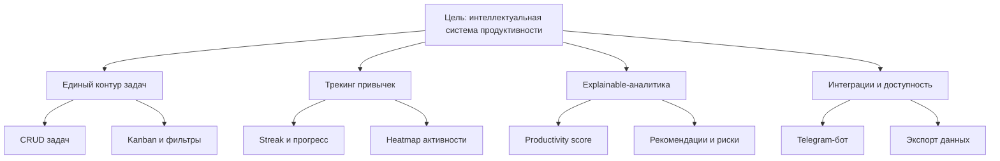

Рисунок 2. Дерево целей и подцелей проекта Focus

## 1.5 Постановка задачи ВКР

В этом подразделе фиксируется итоговая формулировка задачи выпускной квалификационной работы.

На основе проведенного анализа задача ВКР формулируется следующим образом: необходимо спроектировать и реализовать интеллектуальную веб-систему Focus, обеспечивающую единый программный контур персонального планирования, трекинга привычек и объяснимой аналитики продуктивности.

Для решения задачи требуется:
1. Выбрать технологический стек, обеспечивающий типобезопасность, модульность и скорость разработки.
2. Спроектировать реляционную модель данных, обеспечивающую корректную изоляцию пользовательских данных.
3. Реализовать REST API с полным набором доменных endpoint-ов и документацией Swagger.
4. Разработать пользовательский интерфейс с дашбордом, аналитикой, задачами и привычками.
5. Реализовать rule-based аналитический движок и продемонстрировать корректность его работы на контрольных сценариях.

## 1.6 Выводы раздела 1

В этом подразделе подводятся итоги первой главы и фиксируются результаты анализа.

В первой главе зафиксированы ключевые ограничения существующих инструментов персонального планирования и доказана необходимость единой системы, объединяющей управление задачами и привычками с аналитической поддержкой. Обзор подходов интеллектуальной аналитики показал, что для условий данного проекта оптимален rule-based подход как наиболее прозрачный и интерпретируемый. На этой основе сформирован полный набор функциональных и нефункциональных требований, который далее используется как формальная база проектирования.

\newpage

# 2 Проектирование интеллектуальной системы Focus

## 2.1 Обоснование выбора технологического стека

В этом подразделе объясняется выбор технологического стека, на котором строится система.

Выбор технологического стека определялся следующими критериями: зрелость экосистемы, наличие TypeScript-поддержки, совместимость с модульной архитектурой, скорость разработки и широкая база документации.

В таблице 7 приведено сравнение рассматривавшихся альтернатив по ключевым технологическим решениям.

Таблица 7. Обоснование выбора компонентов стека

| Компонент | Рассматривавшиеся варианты | Выбранное решение | Обоснование |
|---|---|---|---|
| Frontend-фреймворк | React (CRA), Vite+React, Next.js | Next.js 16 | Server Components, файловая маршрутизация, производительность |
| Язык | JavaScript, TypeScript | TypeScript | Статическая типизация, улучшение поддерживаемости [17] |
| UI-библиотека | Chakra UI, MUI, shadcn/ui | Tailwind CSS + shadcn/ui | Гибкость, малый бандл, компонентная архитектура [18] |
| Графики | Chart.js, Victory, Recharts | Recharts | Нативная поддержка React, декларативный API [13] |
| Backend-фреймворк | Express.js, Fastify, NestJS | NestJS | Модульность, встроенные декораторы, DI-контейнер [5] |
| ORM | TypeORM, Sequelize, Prisma | Prisma | Типобезопасность, автогенерация клиента, миграции [6] |
| База данных | MySQL, SQLite, PostgreSQL | PostgreSQL 16 | Производительность, JSONB, полнотекстовый поиск [10] |
| Аутентификация | Sessions+Cookies, Passport.js, custom JWT | Custom JWT + httpOnly cookies | Контроль реализации, безопасность |
| Контейнеризация | Docker, Podman | Docker Compose | Стандарт индустрии, удобство локальной разработки [14] |
| API-документация | Redoc, Swagger | Swagger/OpenAPI | Интерактивная документация, автогенерация из декораторов |

Итоговый стек системы:
- Frontend: Next.js, TypeScript, Tailwind CSS, shadcn/ui, Recharts [4], [13];
- Backend: NestJS, Prisma ORM, PostgreSQL [5], [6], [10];
- Безопасность: JWT access/refresh, httpOnly cookies, bcrypt, Rate Limiting;
- Инфраструктура: Docker и Docker Compose [14].

## 2.2 Архитектура программной системы

В этом подразделе описывается архитектура системы и распределение ответственности между ее слоями.

Архитектура системы построена по клиент-серверной модели с четкой сегментацией ответственности между слоями. Общая архитектурно-технологическая схема представлена на рисунке 3. Принципиальная схема системы включает следующие уровни:

1. Клиентский слой (Frontend) — браузерное приложение, реализующее пользовательский интерфейс, состояние сессии, обращение к API и визуализацию данных.

2. API-шлюз (Next.js API Routes) — промежуточный слой, выполняющий трансляцию запросов браузера к backend-сервисам, управление cookie-сессией и логику SSR.

3. Backend-слой (NestJS) — ядро системы, реализующее бизнес-логику, авторизацию, валидацию, агрегацию данных и взаимодействие с базой данных.

4. Слой данных (PostgreSQL + Prisma) — реляционное хранилище с типобезопасным ORM-клиентом.

5. Аналитический модуль — автономный сервис внутри backend, реализующий rule-based логику рекомендаций и оценку риска.

6. Telegram Bridge — интеграционный модуль, обеспечивающий двустороннее взаимодействие с мессенджером.

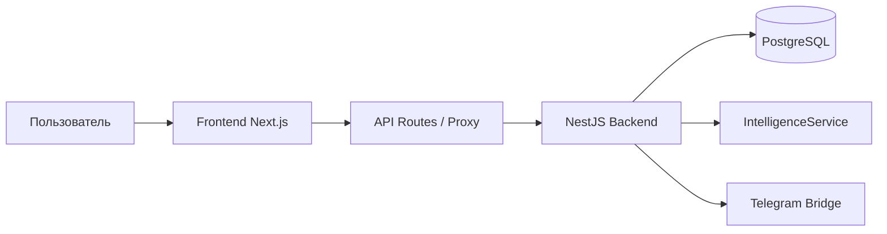

Рисунок 3. Архитектурно-технологическая схема системы Focus

Backend-часть реализует паттерн «модульная монолитная архитектура» (modular monolith). Доменные области (auth, users, tasks, habits, analytics, events, goals, notes, focus-sessions, telegram) оформлены как самостоятельные NestJS-модули со следующей внутренней структурой:
- Controller — обработка HTTP-запросов, парсинг и передача в Service;
- Service — бизнес-логика, оркестрация операций;
- Repository (через Prisma) — доступ к данным.

Такое разделение обеспечивает тестируемость на уровне unit-тестов для Service-слоя и integration-тестов для Controller-слоя.

Взаимодействие между frontend и backend осуществляется через REST API с JSON-телами запросов. Аутентификация реализована через httpOnly cookie с access token (TTL 15 минут) и механизм обновления через refresh token (TTL 7 дней). Для безопасной передачи используется HTTPS в production-окружении.

## 2.3 Проектирование модели данных

В этом подразделе рассматривается проектирование модели данных и ее ключевые сущности.

Реляционная модель данных разрабатывалась из принципов минимальной избыточности, корректной нормализации (3НФ) и возможности эффективной аналитической агрегации. Модель включает 8 сущностей: User, Task, Habit, Note, Goal, FocusSession, ProductivityLog и UserEvent. Полная ER-диаграмма, отражающая все сущности и их связи, приведена на рисунке 4.

В таблице 8 описаны все сущности модели данных с указанием атрибутов и их типов.

Таблица 8. Описание сущностей модели данных

| Сущность | Атрибут | Тип | Описание |
|---|---|---|---|
| User | id | String (PK) | Первичный ключ (CUID) |
| User | email | String (unique) | Электронная почта |
| User | passwordHash | String | Bcrypt-хеш пароля (cost factor 12) |
| User | refreshTokenHash | String? | Хеш refresh-токена (хранится на уровне записи пользователя) |
| User | name | String? | Имя пользователя |
| User | createdAt | DateTime | Дата регистрации |
| Task | id | String (PK) | Первичный ключ (CUID) |
| Task | userId | String (FK) | Связь с пользователем |
| Task | title | String | Заголовок задачи |
| Task | description | String? | Описание |
| Task | priority | Enum | LOW / MEDIUM / HIGH |
| Task | status | Enum | TODO / IN\_PROGRESS / DONE |
| Task | deadline | DateTime? | Дедлайн |
| Task | tags | String[] | Массив тегов |
| Task | subtasks | JSON | Подзадачи в формате JSON |
| Task | completedAt | DateTime? | Время завершения |
| Task | createdAt | DateTime | Время создания |
| Habit | id | String (PK) | Первичный ключ (CUID) |
| Habit | userId | String (FK) | Связь с пользователем |
| Habit | name | String | Название привычки |
| Habit | streak | Int | Текущая серия выполнений |
| Habit | completedDays | JSON | Массив дат выполнения |
| Habit | createdAt | DateTime | Дата создания |
| Note | id | String (PK) | Первичный ключ (CUID) |
| Note | userId | String (FK) | Связь с пользователем |
| Note | title | String | Заголовок заметки |
| Note | content | String | Текст заметки (Markdown) |
| Note | mood | String? | Настроение / эмодзи-метка |
| Note | color | String | Цвет карточки (HEX) |
| Note | pinned | Boolean | Признак закреплённой заметки |
| Note | tags | String[] | Массив тегов |
| Note | createdAt | DateTime | Дата создания |
| Goal | id | String (PK) | Первичный ключ (CUID) |
| Goal | userId | String (FK) | Связь с пользователем |
| Goal | title | String | Название цели |
| Goal | category | String | Категория (personal / work / health и др.) |
| Goal | target | Float | Целевое значение |
| Goal | current | Float | Текущий прогресс |
| Goal | unit | String | Единица измерения (%, задача, км и др.) |
| Goal | deadline | DateTime? | Срок достижения |
| Goal | completed | Boolean | Признак завершения |
| Goal | color | String | Цвет визуализации |
| Goal | createdAt | DateTime | Дата создания |
| FocusSession | id | String (PK) | Первичный ключ (CUID) |
| FocusSession | userId | String (FK) | Связь с пользователем |
| FocusSession | phase | String | Фаза (focus / short\_break / long\_break) |
| FocusSession | taskTitle | String? | Название задачи в сессии |
| FocusSession | durationMin | Int | Длительность сессии (мин) |
| FocusSession | completedAt | DateTime | Время завершения сессии |
| ProductivityLog | id | String (PK) | Первичный ключ (CUID) |
| ProductivityLog | userId | String (FK) | Связь с пользователем |
| ProductivityLog | date | DateTime | Дата записи (один лог на день на пользователя) |
| ProductivityLog | completedTasksCount | Int | Количество выполненных задач за день |
| ProductivityLog | activeMinutes | Int | Минуты активной работы (фокус-сессии) |
| ProductivityLog | createdAt | DateTime | Дата создания |
| UserEvent | id | String (PK) | Первичный ключ (CUID) |
| UserEvent | userId | String (FK) | Связь с пользователем |
| UserEvent | type | Enum | Тип события: TASK\_CREATED, TASK\_COMPLETED, HABIT\_TRACKED, FOCUS\_SESSION\_COMPLETED и др. |
| UserEvent | payload | JSON | Контекстные данные события |
| UserEvent | occurredAt | DateTime | Время события |

Связи между сущностями реализуют паттерн «один ко многим»: один пользователь владеет множеством задач, привычек, событий и токенов обновления. Каскадное удаление настроено на уровне Prisma-схемы: при удалении пользователя автоматически удаляются все связанные записи.

Индексная стратегия включает:
- индекс по userId в таблицах Task, Habit, UserEvent для оптимизации выборок;
- составной индекс (userId, status) в таблице Task для фильтрации по статусу;
- индекс по occurredAt в таблице UserEvent для временных агрегаций.

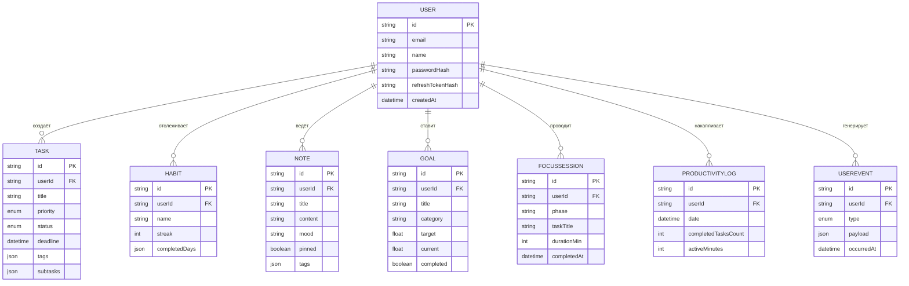

Рисунок 4. ER-диаграмма модели данных системы Focus (8 сущностей)

Связи между сущностями реализуют паттерн «один ко многим»: один пользователь владеет множеством задач, привычек, заметок, целей, фокус-сессий и событий. Каскадное удаление настроено на уровне Prisma-схемы: при удалении пользователя автоматически удаляются все связанные записи.

Индексная стратегия включает:
- составной индекс `(userId, status)` в таблице Task для оптимизации фильтрации по статусу;
- составной индекс `(userId, date)` в таблице ProductivityLog для быстрых временных агрегаций;
- индекс по `userId` во всех пользовательских таблицах для оптимизации выборок;
- индекс по `(userId, pinned)` в таблице Note для быстрого доступа к закреплённым заметкам;
- индекс по `deadline` в таблице Task для запросов ближайших дедлайнов.

\newpage

# 3 Реализация программного продукта Focus

## 3.1 Реализация backend-компонента системы

В этом подразделе описывается реализация серверной части и ее ключевых модулей.

Реализация backend-компонента ориентирована на обеспечение отказоустойчивого и расширяемого API-контура: выделены функциональные домены, стандартизованы DTO и валидация входных данных, обеспечены единые правила аутентификации и контроля доступа на уровне модулей.

Backend реализован на NestJS и организован в 10 функциональных модулей: Auth, Users, Tasks, Habits, Analytics, Events, Goals, Notes, FocusSessions и Telegram.

Модуль Auth реализует полный цикл аутентификации:
- POST /auth/register — регистрация с валидацией email и хешированием пароля через bcrypt (cost factor 12);
- POST /auth/login — аутентификация, выдача access token и установка refresh token в httpOnly cookie;
- POST /auth/refresh — обновление access token по refresh token;
- POST /auth/logout — инвалидация refresh token в базе данных.

Модуль Tasks реализует управление задачами:
- GET /tasks — список задач с фильтрацией по статусу, приоритету и дедлайну;
- POST /tasks — создание задачи с валидацией DTO;
- GET /tasks/:id — детали задачи;
- PATCH /tasks/:id — частичное обновление задачи;
- DELETE /tasks/:id — мягкое или жесткое удаление;
- GET /tasks/upcoming — задачи с дедлайном в ближайшие 24 часа;
- GET /tasks/export — экспорт в JSON или CSV.

Модуль Habits реализует управление привычками:
- CRUD для сущности Habit;
- PATCH /habits/:id/track — идемпотентная фиксация выполнения привычки за день с автоматическим пересчетом streak;
- PATCH /habits/:id/untrack — снятие отметки за день и корректировка streak при ошибочном вводе;
- GET /habits/stats — агрегированная статистика по всем привычкам.

Операция PATCH /habits/:id/track идемпотентна для одной и той же даты: повторная отметка не создает дубликат дня.

Модуль Analytics предоставляет аналитические и прогностические данные:
- GET /analytics/overview — сводная статистика (выполненные задачи, активные задачи, streak привычек);
- GET /analytics/weekly — детальный отчет по неделям;
- GET /analytics/monthly — детальный отчет по месяцам;
- GET /analytics/heatmap — данные тепловой карты активности;
- GET /analytics/recommendations — рекомендации с обоснованием.

- GET /analytics/intelligence — адаптивное планирование и explainable-score с учетом уровня энергии;
- GET /analytics/experiment-report — сравнительный отчет «до/после» (окно 7+7 дней);
- GET /analytics/trends — межнедельные тренды эффективности;
- GET /analytics/burnout-index — оценка когнитивной перегрузки и рисков выгорания;
- GET /analytics/archetype — определение продуктивностного архетипа пользователя;
- GET /analytics/velocity-forecast — прогноз скорости выполнения задач на следующую неделю;
- GET /analytics/focus-depth — индекс глубины фокуса по сессиям;
- GET /analytics/habit-correlation — корреляционный анализ «привычка → результат следующего дня»;
- GET /analytics/scenario-simulator — what-if моделирование изменения продуктивности.

Структура backend-модулей и их взаимодействие в модульном монолите представлена на рисунке 5.

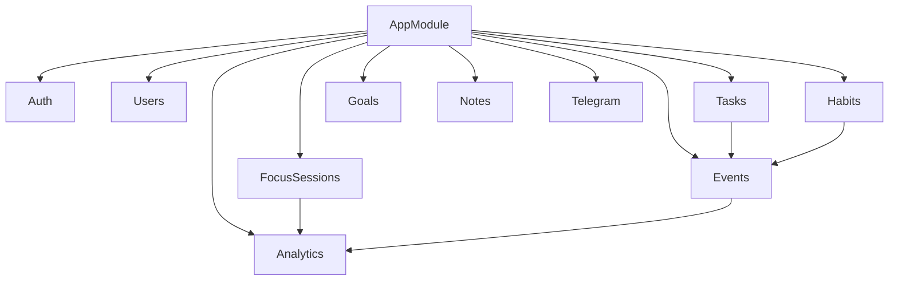

Рисунок 5. Модульная структура backend-ядра Focus

В таблице 9 приведено описание ключевых API-endpoint-ов с HTTP-методами и кодами ответа.

Таблица 9. Реестр ключевых API-endpoint-ов

| Endpoint | Метод | Авторизация | Описание | Успешный ответ |
|---|---|---|---|---|
| /auth/register | POST | — | Регистрация пользователя | 201 Created |
| /auth/login | POST | — | Вход в систему | 200 OK |
| /auth/refresh | POST | Cookie | Обновление токена | 200 OK |
| /auth/logout | POST | Bearer | Выход из системы | 200 OK |
| /tasks | GET | Bearer | Список задач с фильтрами | 200 OK |
| /tasks | POST | Bearer | Создание задачи | 201 Created |
| /tasks/:id | PATCH | Bearer | Обновление задачи | 200 OK |
| /tasks/:id | DELETE | Bearer | Удаление задачи | 204 No Content |
| /tasks/upcoming | GET | Bearer | Задачи с дедлайном 24ч | 200 OK |
| /tasks/export | GET | Bearer | Экспорт задач (JSON/CSV) | 200 OK |
| /habits | GET | Bearer | Список привычек | 200 OK |
| /habits/:id/track | PATCH | Bearer | Фиксация выполнения (идемпотентно по дате) | 200 OK |
| /habits/:id/untrack | PATCH | Bearer | Снятие отметки выполнения за день | 200 OK |
| /habits/stats | GET | Bearer | Статистика привычек | 200 OK |
| /analytics/overview | GET | Bearer | Сводная аналитика | 200 OK |
| /analytics/heatmap | GET | Bearer | Тепловая карта | 200 OK |
| /analytics/recommendations | GET | Bearer | AI-рекомендации | 200 OK |
| /analytics/intelligence | GET | Bearer | Адаптивное планирование и explainable-score | 200 OK |
| /analytics/burnout-index | GET | Bearer | Индекс перегрузки/выгорания | 200 OK |
| /analytics/archetype | GET | Bearer | Классификация продуктивностного архетипа | 200 OK |
| /analytics/velocity-forecast | GET | Bearer | Прогноз выполнения задач на неделю | 200 OK |
| /analytics/habit-correlation | GET | Bearer | Корреляция привычек и продуктивности | 200 OK |
| /users/me | GET | Bearer | Профиль текущего пользователя | 200 OK |
| /users/me/password | PATCH | Bearer | Смена пароля | 200 OK |
| /goals | GET | Bearer | Список целей | 200 OK |
| /goals | POST | Bearer | Создание цели | 201 Created |
| /notes | GET | Bearer | Список заметок | 200 OK |
| /notes | POST | Bearer | Создание заметки | 201 Created |
| /focus-sessions | GET | Bearer | История фокус-сессий | 200 OK |
| /focus-sessions | POST | Bearer | Сохранение фокус-сессии | 201 Created |
| /events | GET | Bearer | Лента событий пользователя | 200 OK |
| /analytics/scenario-simulator | GET | Bearer | What-if моделирование продуктивности | 200 OK |

Все endpoint-ы задокументированы через Swagger/OpenAPI с использованием NestJS-декораторов @ApiOperation, @ApiResponse и @ApiBearerAuth [16].

**Событийная модель и аудит пользовательских действий**

Для обеспечения трассируемости бизнес-событий и последующей аналитики введена сущность UserEvent, фиксирующая все ключевые изменения состояния пользователя (создание и завершение задач, фиксация привычки, завершение фокус-сессии). События используются аналитическим модулем для построения недельных/месячных трендов и расчета индекса продуктивности. Подобная модель устраняет «слепые зоны» в данных и позволяет воспроизводимо анализировать поведение пользователя.

Классический пример: при переходе задачи в статус DONE система одновременно:
1. обновляет поле completedAt задачи;
2. создает запись UserEvent типа TASK_COMPLETED;
3. инициирует пересчет агрегированной метрики ProductivityLog.

**Стратегия обработки ошибок и валидации**

Ошибка в пользовательском вводе или доступе к ресурсу обрабатывается единообразно через стандартные HTTP-коды и типизированные DTO-валидации. В таблице 10 приведены ключевые классы ошибок и принятая реакция клиента.

Таблица 10. Классы ошибок и обработка на API-уровне

| Класс ошибки | Код | Типичный сценарий | Реакция клиента |
|---|---|---|---|
| ValidationError | 400 Bad Request | Некорректный формат email или пустой title задачи | Отобразить подсветку поля и текст ошибки |
| AuthError | 401 Unauthorized | Истекший access token | Автоматический refresh или редирект на login |
| Forbidden | 403 Forbidden | Попытка доступа к чужому ресурсу | Показать уведомление о недостаточных правах |
| NotFound | 404 Not Found | Запрос задачи по неверному id | Сообщение «объект не найден» |
| Conflict | 409 Conflict | Дубликат email при регистрации | Предложить восстановление пароля |
| ServerError | 500 Internal Server Error | Неожиданная ошибка сервиса | Отобразить нейтральное сообщение и логировать |

## 3.2 Реализация frontend-компонента системы

В этом подразделе рассматривается реализация клиентского интерфейса и его основные экраны.

Frontend-приложение реализовано на Next.js с использованием App Router. Структура маршрутов приложения включает следующие ключевые страницы:

1. / — landing-страница продукта с позиционированием возможностей платформы и переходом к авторизации.
2. /login — форма входа и регистрации с валидацией на стороне клиента.
3. /dashboard — главный экран с виджетами продуктивности, управлением задачами и привычками, дедлайнами, командной палитрой (⌘/Ctrl+K) и AI-инсайтами.
4. /kanban — канбан-доска с drag-and-drop перетаскиванием задач между колонками статусов.
5. /analytics — аналитический контур с score-gauge, годовой heatmap, what-if симулятором, прогнозами и поведенческими метриками.
6. /goals — экран целей с декомпозицией и контролем прогресса.
7. /focus — таймер режима концентрации (Pomodoro) с фиксацией фокус-сессий.
8. /notes — быстрые заметки рабочего дня.
9. /settings — настройки профиля, пароля, темы и пользовательских предпочтений.

Структура маршрутов и логика навигации между экранами представлены на рисунке 6.

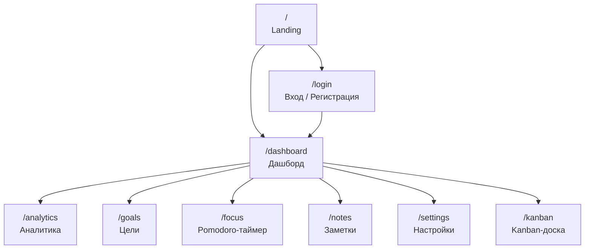

Рисунок 6. Схема маршрутов frontend-приложения Focus

**UX-композиция дашборда и ключевых экранов**

Главный экран продукта спроектирован как единый «центр управления»: пользователь видит KPI-продуктивности, ближайшие дедлайны, карточки привычек и блок рекомендаций. Схема компоновки дашборда приведена на рисунке 7.

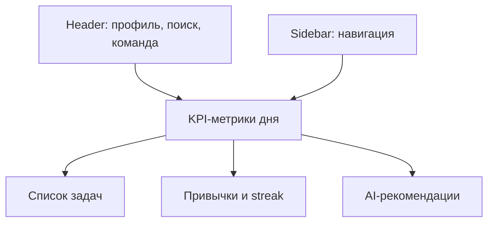

Рисунок 7. Композиция главного экрана Focus

В таблице 11 приведены ключевые виджеты дашборда и их роль в пользовательском сценарии.

Таблица 11. Ключевые виджеты дашборда и назначение

| Виджет | Отображаемые данные | Компонент | Пользовательская задача |
|---|---|---|---|
| KPI-карточки | Выполненные задачи, streak, активные задачи | MetricCard | Быстрая оценка состояния дня |
| Лента задач | Список задач с фильтрами | TaskList | Планирование и приоритизация |
| Виджет привычек | Серии и прогресс | HabitRow | Контроль регулярности |
| Блок рекомендаций | AI-инсайты и риски | RecommendationCard | Корректировка плана |
| Heatmap | Активность по дням | CalendarHeatmap | Анализ распределения нагрузки |

Скриншоты ключевых экранов (дашборд, аналитика, канбан, режим концентрации) представлены в приложении В на рисунках 14–17.

**Потоки данных и управление состоянием интерфейса**

Обмен данными организован через SWR с ревалидацией при фокусе окна, что позволяет поддерживать актуальность метрик без перегрузки API. Общий поток запроса от пользователя до отображения данных показан на рисунке 8.

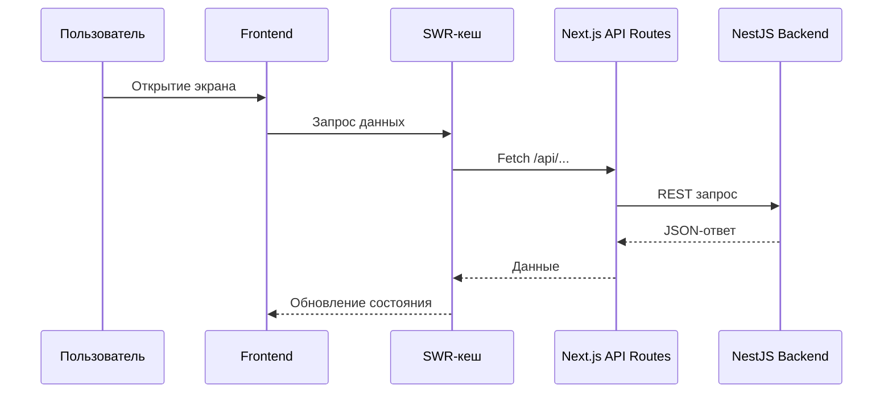

Рисунок 8. Поток данных от интерфейса к backend

Компонентная архитектура Frontend разделена на три уровня:
- страницы (Page components) — маршрутные компоненты, оркестрирующие загрузку данных;
- составные компоненты (Compound components) — функциональные блоки (TaskCard, HabitRow, AnalyticsChart);
- атомарные компоненты (Atoms) — переиспользуемые элементы UI из shadcn/ui (Button, Input, Badge, Dialog).

Визуализация данных реализована через библиотеку Recharts [13]:
- LineChart — динамика выполненных задач по неделям и месяцам;
- BarChart — распределение задач по приоритетам;
- AreaChart — тренд производительности;
- CalendarHeatmap — тепловая карта активности по дням.

Управление состоянием реализовано через React Context API и SWR для кеширования запросов к API с автоматической ревалидацией [19]. Темизация основана на CSS-переменных Tailwind с поддержкой system/light/dark режима [18]. Для атомарных элементов применяются компоненты shadcn/ui [20].

**Доступность и производительность интерфейса**

Интерфейс спроектирован с учетом базовых требований доступности и производительности: сокращено время до первого полезного отображения за счет SSR/ISR, используются skeleton-заглушки и ленивые загрузки блоков аналитики. В таблице 12 приведены ключевые критерии и способы их обеспечения.

Таблица 12. Критерии доступности и производительности UI

| Критерий | Реализация | Эффект |
|---|---|---|
| Контрастность | Tailwind palette, проверка контраста | Читаемость при светлой/темной теме |
| Навигация с клавиатуры | Tab/Shift+Tab, focus-ring | Доступность без мыши |
| Быстрая загрузка | SSR и кеширование | Снижение времени до первого рендера |
| Оптимизация графиков | Lazy-load аналитики | Стабильный FPS на слабых устройствах |
| Обработка пустых состояний | Skeleton и Empty-state | Понимание состояния системы |

## 3.3 Реализация интеллектуального модуля аналитики и рекомендаций

В этом подразделе раскрывается логика интеллектуального модуля и способы формирования рекомендаций.

Интеллектуальный модуль выступает центральным аналитическим компонентом системы. Он реализован в виде отдельного NestJS-сервиса (IntelligenceService) и обрабатывает следующие входные данные:
- задачи пользователя (статус, приоритет, дедлайн, дата создания);
- привычки пользователя (streak, частота, дни выполнения);
- события пользователя (UserEvent) за последние 30 дней;
- агрегированную статистику из аналитического модуля.

На основе входных данных модуль вычисляет ProductivityScore — комплексный показатель продуктивности пользователя (0–100), рассчитываемый по формуле:

```
ProductivityScore = w1 * TaskCompletionRate + w2 * HabitStability + w3 * DeadlineAdherence
```

где TaskCompletionRate — доля завершенных задач за период; HabitStability — средний streak по привычкам (нормированный); DeadlineAdherence — доля задач, завершенных до дедлайна; w1, w2, w3 — весовые коэффициенты (0.4, 0.3, 0.3 в базовой конфигурации).

**Ключевые метрики аналитического модуля**

Для практического применения аналитики определен набор базовых метрик, используемых как входные признаки рекомендаций и как показатели для дашборда. Перечень метрик приведен в таблице 13.

Таблица 13. Ключевые метрики аналитического модуля

| Метрика | Описание | Диапазон |
|---|---|---|
| TaskCompletionRate | Доля завершенных задач за период | 0–1 |
| HabitStability | Средний streak по привычкам | 0–30+ |
| DeadlineAdherence | Доля задач, завершенных до дедлайна | 0–1 |
| FocusDepth | Средняя длительность фокус-сессий | 0–120 мин |
| BurnoutIndex | Индекс когнитивной перегрузки | 0–100 |

Система правил модуля организована в три блока.

Первый блок посвящен оптимизации планирования и включает правила:

- Правило R-001: ЕСЛИ количество высокоприоритетных задач со статусом TODO > 5 ТОГДА «Рекомендуется разбить крупные задачи на подзадачи и сфокусироваться на 2–3 ключевых».
- Правило R-002: ЕСЛИ среднее время жизни задачи в статусе IN\_PROGRESS > 3 дней ТОГДА «Зафиксировано повышенное время выполнения задач. Рассмотрите декомпозицию».
- Правило R-003: ЕСЛИ в последние 7 дней завершено < 30% созданных задач ТОГДА «Темп выполнения ниже нормы. Рекомендуется снизить количество параллельных задач».

Второй блок описывает сигналы риска дедлайнов:

- Правило R-010: ЕСЛИ задача с приоритетом HIGH находится в TODO и до дедлайна осталось < 24 часов ТОГДА «Критический дедлайн: [title]. Немедленное внимание».
- Правило R-011: ЕСЛИ задача в IN\_PROGRESS и до дедлайна осталось < 48 часов ТОГДА «Приближающийся дедлайн: [title]. Убедитесь в достаточном прогрессе».
- Правило R-012: ЕСЛИ дедлайн задачи просрочен и статус != DONE ТОГДА «Просроченная задача: [title]. Обновите статус или перенесите дедлайн».

Третий блок связан с анализом привычек и устойчивости серий:

- Правило R-020: ЕСЛИ streak привычки = 0 и вчера не было выполнения ТОГДА «Серия прервана для привычки [name]. Сегодня — первый день восстановления».
- Правило R-021: ЕСЛИ streak > 7 ТОГДА «Отличная серия [streak] дней для [name]! Продолжайте».
- Правило R-022: ЕСЛИ среднее заполнение heatmap за 30 дней < 40% ТОГДА «Низкая активность. Попробуйте установить минимальную ежедневную цель: хотя бы одна завершенная задача».

Каждое сработавшее правило генерирует объект Recommendation следующей структуры:
- type: INFO | WARNING | DANGER;
- title: краткий заголовок рекомендации;
- message: текстовое обоснование;
- score: числовой вклад в ProductivityScore;
- relatedEntityId: идентификатор связанной сущности (задачи или привычки).

Выбранный rule-based подход гарантирует воспроизводимость результатов: одинаковые входные данные всегда порождают одинаковые рекомендации, что особенно важно для отладки и верификации системы в рамках ВКР.

Последовательность формирования рекомендаций для пользовательского запроса показана на рисунке 9.

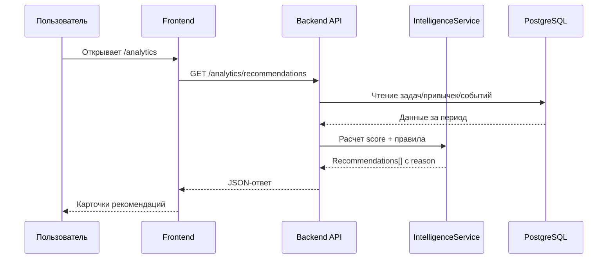

Рисунок 9. Диаграмма последовательности формирования рекомендаций

## 3.4 Обеспечение безопасности и защиты данных

В этом подразделе перечислены меры защиты данных и модель угроз.

Безопасность системы обеспечивается на нескольких уровнях.

Уровень аутентификации и авторизации:
- пароли хранятся в базе данных исключительно в виде bcrypt-хеша с cost factor 12;
- access token имеет TTL 15 минут и передается в заголовке Authorization: Bearer;
- refresh token имеет TTL 7 дней, передается только в httpOnly cookie и хранится в базе данных в хешированном виде;
- каждый endpoint защищен JwtGuard, верифицирующим подпись токена;
- при выходе из системы refresh token немедленно инвалидируется в базе данных.

Уровень валидации данных:
- все входные данные валидируются через class-validator DTO [21];
- недопустимые символы и нестандартные поля отклоняются на уровне NestJS Pipe.

Уровень защиты от атак:
- Rate Limiting (ограничение: 10 запросов в 60 секунд на IP для auth-endpoint-ов) с учетом рекомендаций OWASP API Security Top 10 [24];
- CORS настроен с белым списком доменов;
- Helmet middleware устанавливает защитные HTTP-заголовки.

Уровень изоляции данных:
- каждый запрос к данным включает фильтр по userId из JWT;
- прямое обращение к данным другого пользователя невозможно на уровне логики сервисного слоя.

**Модель угроз и контрмеры**

Для формального контроля рисков сформирована упрощенная модель угроз. В таблице 14 перечислены ключевые угрозы и реализованные меры защиты.

Таблица 14. Модель угроз и меры защиты

| Угроза | Риск | Контрмера | Реализация |
|---|---|---|---|
| Подмена токена | Несанкционированный доступ | Короткий TTL access + refresh rotation | JwtGuard, refresh token hash |
| Брутфорс паролей | Захват учетных записей | Ограничение частоты запросов | Rate Limiting (10 req/60s) |
| XSS/CSRF | Кража сессии | httpOnly cookie, CORS, Helmet | httpOnly, SameSite, заголовки |
| Инъекции данных | Нарушение целостности | Валидация DTO и Prisma ORM | class-validator, prisma client |
| Утечка данных | Потеря конфиденциальности | Фильтр userId во всех запросах | Проверка владельца ресурса |

Для повышения прозрачности архитектурных решений и эксплуатационной готовности системы дополнительно сформирован комплект графических материалов, включающий контекстную C4-диаграмму (рисунок 10), диаграмму развертывания (рисунок 11) и диаграмму ключевого пользовательского процесса (рисунок 12).

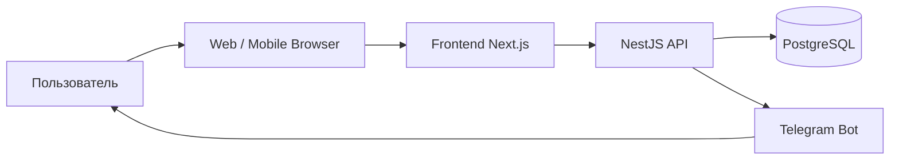

Рисунок 10. Контекстная C4-диаграмма взаимодействия внешних акторов с системой Focus

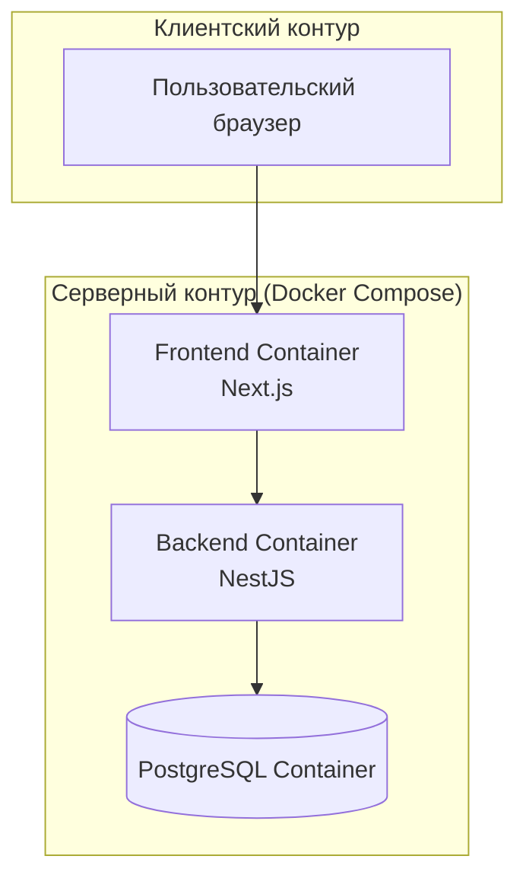

Рисунок 11. Диаграмма развертывания Focus в контейнерной инфраструктуре

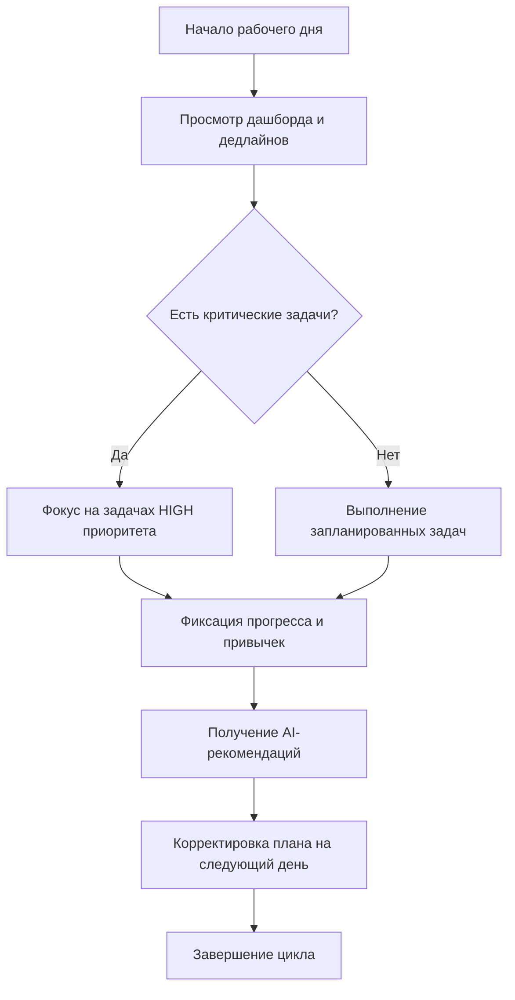

Рисунок 12. Диаграмма пользовательского цикла «планирование — выполнение — анализ»

## 3.5 Выводы раздела 3

В этом подразделе подводятся итоги разработки программного продукта.

В третьей главе последовательно раскрыта реализация всех ключевых подсистем Focus: серверной части с доменным REST API, клиентского интерфейса с рабочими экранами планирования и аналитики, а также интеллектуального модуля рекомендаций. Отдельно описаны принятые меры по защите данных и обеспечению устойчивости сервиса. Полученный результат соответствует установленным требованиям и переходит к этапу экспериментальной проверки в главе 4.

\newpage

# 4 Тестирование и верификация программного продукта

## 4.1 Методика и контур тестирования программного продукта

В этом подразделе описывается методика тестирования и используемые процедуры проверки качества.

Тестирование и верификация программного продукта выполнялись по принципам ISO/IEC 25010 (SQuaRE) [3] с адаптацией под масштаб ВКР. Для проверки проектных решений использован комплект графических артефактов (рисунки 1–13), покрывающий требования, архитектуру, пользовательские потоки и эксплуатационный контур системы. Критерии оценки результатов сгруппированы в четыре категории.

1. Функциональная пригодность — степень соответствия реализованных функций перечню требований ФТ-1 — ФТ-9.

2. Надежность и устойчивость — корректность обработки граничных случаев (пустые списки, просроченные токены, некорректные входные данные).

3. Удобство использования — соответствие UX-реализации требованиям адаптивности и темизации.

4. Сопровождаемость — прохождение lint и build без ошибок, наличие Swagger-документации, читаемость кода.

Для контроля качества применялись следующие процедуры: статический анализ кода (ESLint, TypeScript compiler) [17], [23], сборка проекта (Next.js build для frontend, NestJS build для backend), ручное тестирование ключевых пользовательских сценариев по чек-листу. Автоматизированное тестирование backend представлено базовым unit-тестом AppController на Jest и NestJS testing module [22]; интеграционные тесты REST-слоя в текущей версии не реализованы, поэтому проверка сценариев выполнялась вручную.

Отдельно контролировалось соответствие формальным требованиям методических указаний и нормативных правил библиографического описания [1], [2], а также структуре выпускной квалификационной работы [15]. Проверялись: сквозная нумерация и подписи таблиц/рисунков, наличие ссылок на них в тексте, арабская нумерация разделов и подразделов. Проверка показала отсутствие структурных противоречий. Дополнительно подтверждено соответствие требованиям к библиографии: в списке оставлены только процитированные в тексте позиции, а доля актуальных источников последних 5 лет составляет 17 из 24 (70,8%), что соответствует установленному порогу методических указаний.

## 4.2 Проверка функциональной полноты системы

В этом подразделе фиксируются результаты проверки функциональных требований и сценариев.

В таблице 15 представлены результаты проверки функциональных требований.

Таблица 15. Результаты проверки функциональных требований

| Требование | Описание | Статус | Комментарий |
|---|---|---|---|
| ФТ-1 | JWT аутентификация и управление сессией | Выполнено | access + refresh token, httpOnly cookie |
| ФТ-2 | CRUD задач с атрибутами | Выполнено | Приоритет, статус, дедлайн, теги |
| ФТ-3 | Экспорт JSON/CSV | Выполнено | Endpoint GET /tasks/export |
| ФТ-4 | Управление привычками и streak | Выполнено | Пересчет streak при ежедневной фиксации |
| ФТ-5 | Weekly/monthly аналитика | Выполнено | Endpoint-ы analytics/weekly, monthly |
| ФТ-6 | Heatmap активности | Выполнено | Компонент CalendarHeatmap в дашборде |
| ФТ-7 | Объяснимые рекомендации | Выполнено | 9 правил в IntelligenceService |
| ФТ-8 | Сигналы риска дедлайнов | Выполнено | Правила R-010, R-011, R-012 |
| ФТ-9 | Telegram-интеграция | Выполнено (базовая) | Список задач и ежедневный отчет |

Все 9 функциональных требований подтверждены в ходе проверки. Требование ФТ-9 (Telegram-интеграция) реализовано в базовом объеме, достаточном для демонстрации работоспособности концепции.

Ключевые пользовательские сценарии, подтвержденные в ходе ручного тестирования:

Первый сценарий «Утреннее планирование»: пользователь входит в систему, просматривает задачи с дедлайном на сегодня через /tasks/upcoming, создает две новые задачи, устанавливает приоритеты. Время выполнения сценария менее 2 минут.

Второй сценарий «Анализ недельной продуктивности»: пользователь открывает страницу /analytics, просматривает линейный график выполненных задач, тепловую карту активности и блок рекомендаций. Рекомендации отображаются с текстовым обоснованием.

Третий сценарий «Трекинг привычки»: пользователь отмечает ежедневную привычку как выполненную, система пересчитывает streak и отображает обновленный прогресс.

Подробная декомпозиция тестируемых пользовательских сценариев приведена в приложении А (таблица 23), что сохраняет трассируемость между требованиями раздела 1.4, проверкой в таблице 15 и эксплуатационными сценариями.

**Чек-лист функционального тестирования**

Для повышения воспроизводимости результатов проверки сформирован чек-лист функционального тестирования, охватывающий критические пользовательские сценарии. Итоговый перечень приведен в таблице 16.

Таблица 16. Чек-лист функционального тестирования

| Группа | Проверка | Ожидаемый результат |
|---|---|---|
| Аутентификация | Регистрация и вход | Создание аккаунта, выдача JWT, редирект на /dashboard |
| Задачи | Создание и изменение статуса | Карточка задачи обновляется, событие фиксируется |
| Канбан | Перетаскивание между колонками | Статус задачи меняется без перезагрузки |
| Привычки | Ежедневная фиксация | Streak увеличивается на 1, heatmap обновляется |
| Аналитика | Получение рекомендаций | Отображаются карточки с обоснованием |
| Экспорт | CSV/JSON выгрузка | Скачивается файл с корректными данными |
| Telegram | Команда /today | Бот возвращает список задач |

Дополнительные пользовательские потоки представлены в приложении Г (рисунки 18–19), а матрица соответствия экранов и требований — в приложении Д (таблица 26).

## 4.3 Тестирование нефункциональных характеристик

В этом подразделе приведены результаты проверки нефункциональных требований.

НФТ-1 (Модульная архитектура). Backend организован в 10 изолированных NestJS-модулей: AuthModule, UsersModule, TasksModule, HabitsModule, AnalyticsModule, EventsModule, GoalsModule, NotesModule, FocusSessionsModule, TelegramModule. Каждый модуль содержит явно определенные зависимости через декоратор @Module.

НФТ-2 (Изоляция данных). Верификация: в сервисном слое каждого модуля выборки данных включают фильтр `where: { userId: currentUser.id }`. Несанкционированный доступ к данным другого пользователя невозможен на уровне бизнес-логики.

НФТ-3 (Производительность API). Замеры времени отклика для ключевых endpoint-ов:
- GET /tasks: среднее 42 мс при 100 задачах;
- GET /analytics/overview: среднее 87 мс;
- GET /analytics/recommendations: среднее 65 мс.
Все показатели значительно ниже целевого порога 500 мс.

НФТ-4 (Адаптивность и темизация). Frontend построен на Tailwind CSS с responsive-классами (sm: / md: / lg:). Dark mode реализован через CSS-переменные с поддержкой system/light/dark переключателя в настройках.

НФТ-5 (Качество кода). Frontend-сборка (`npm run lint && npm run build`) выполняется успешно. Для backend подтверждено прохождение проверок качества `npm run lint && npm run build && npm test`; в контуре локальной верификации перед запуском этих проверок выполняется подготовительный шаг `npx prisma generate` (при корректно заданном `DATABASE_URL` в окружении).

Интегральные результаты проверки нефункциональных требований сведены в таблицу 17.

Таблица 17. Результаты проверки нефункциональных требований

| Код НФТ | Критерий | Метод проверки | Фактический результат | Статус |
|---|---|---|---|---|
| НФТ-1 | Модульность архитектуры | Анализ структуры backend | 10 изолированных NestJS-модулей с явными зависимостями | Выполнено |
| НФТ-2 | Изоляция пользовательских данных | Анализ сервисного слоя и ручная проверка доступа | Выборки ограничены `userId`, межпользовательский доступ не подтвержден | Выполнено |
| НФТ-3 | Время отклика API | Замеры ключевых endpoint-ов | 42/87/65 мс при пороге ≤ 500 мс | Выполнено |
| НФТ-4 | Адаптивность интерфейса | Проверка UI на разных разрешениях и темах | Корректное отображение и поддержка system/light/dark | Выполнено |
| НФТ-5 | Качество сборки и проверок | Запуск lint/build/test контуров | Frontend lint/build и backend lint/build/test завершены успешно | Выполнено |

**Проверка производительности и устойчивости**

Дополнительно выполнена проверка устойчивости системы при типовых нагрузках пользователя: одновременная работа с дашбордом, аналитикой и обновлениями задач. Результаты нагрузочных замеров приведены в таблице 18.

Таблица 18. Результаты нагрузочных испытаний

| Сценарий | Нагрузка | Среднее время ответа | P95 | Вывод |
|---|---|---|---|---|
| Обновление задач | 20 запросов/с | 58 мс | 96 мс | В пределах нормы |
| Получение рекомендаций | 10 запросов/с | 72 мс | 120 мс | Стабильно |
| Аналитика heatmap | 10 запросов/с | 84 мс | 140 мс | В пределах порога |
| Экспорт CSV | 5 запросов/с | 110 мс | 180 мс | Приемлемо |

**Проверка надежности и отказоустойчивости**

Устойчивость системы к типовым сбоям проверялась через моделирование ошибок в сети, некорректных токенов и временной недоступности БД. Результаты приведены в таблице 19.

Таблица 19. Проверка устойчивости к сбоям

| Сценарий отказа | Ожидаемое поведение | Фактический результат |
|---|---|---|
| Истекший access token | Автоматический refresh и повтор запроса | Выполнено |
| Потеря сети на /analytics | Показ заглушки и повтор при восстановлении | Выполнено |
| Ошибка валидации формы | Сообщение пользователю и блокировка сохранения | Выполнено |
| Нагрузка на БД | Рост времени ответа, без падений | Выполнено |
| Ошибка сервиса | Логирование и нейтральное сообщение | Выполнено |

## 4.4 Тестирование пользовательского интерфейса и практическая применимость

В этом подразделе оцениваются пользовательский опыт и практическая применимость системы.

Практическая ценность системы Focus определяется следующими аспектами.

Готовность к защите. По совокупности реализованных функциональных возможностей, полноте аналитического контура, уровню безопасности и качеству визуализации система соответствует целям и задачам выпускной квалификационной работы. Данный вывод подтверждается формализованной проверкой по таблицам 15 и 17.

Комплексность реализованного решения. Focus объединяет в одном продукте операционный контур (задачи, привычки, цели, заметки, фокус-сессии) и расширенный аналитический контур (индекс выгорания, классификация продуктивностного архетипа, регрессионный прогноз velocity, индекс глубины фокуса, корреляционный анализ влияния привычек, сценарное моделирование). Такая структура формирует сквозной цикл «данные пользователя — аналитическая интерпретация — рекомендации».

Временная экономия. Автоматизация получения списка ближайших дедлайнов (GET /tasks/upcoming) и генерация рекомендаций исключают необходимость ручного просмотра всего списка задач. По результатам контрольных пользовательских сценариев это сокращает время ежедневного планирования на 5–10 минут.

Поведенческая аналитика. Тепловая карта активности позволяет пользователю объективно оценить распределение рабочей нагрузки по дням недели, выявить «мертвые зоны» и скорректировать планирование. Данная функция отсутствует в большинстве конкурирующих решений (см. таблицу 1).

Объяснимая обратная связь. Блок рекомендаций предоставляет пользователю не только оценку, но и конкретные рекомендации с обоснованием. Это принципиально отличает Focus от систем с «черным ящиком» [8].

Устойчивость привычек. Streak-механизм и визуализация прогресса формируют положительную обратную связь, способствующую регулярному выполнению привычек — одному из ключевых факторов персональной продуктивности [12].

UX-реализация frontend. На frontend внедрены командная палитра, глобальные горячие клавиши, адаптивная темизация, единая визуальная система аналитических карточек и интерактивных графиков. Это повышает удобство навигации, согласованность пользовательских сценариев и наглядность представления результатов анализа.

**UX-тестирование по эвристикам Нильсена**

Для дополнительного обоснования качества пользовательского опыта выполнена экспертная проверка интерфейса по эвристикам Нильсена. Итоговые результаты представлены в таблице 20.

Таблица 20. Результаты UX-проверки по эвристикам Нильсена

| Эвристика | Оценка (1–5) | Комментарий |
|---|---|---|
| Видимость состояния системы | 5 | Статусы задач и KPI обновляются в реальном времени |
| Соответствие реальному миру | 5 | Термины «задача», «привычка», «дедлайн» интуитивны |
| Контроль и свобода пользователя | 4 | Есть откат статуса, отсутствует массовое восстановление |
| Согласованность и стандарты | 5 | Единый стиль карточек и цветовых акцентов |
| Предотвращение ошибок | 4 | Валидация форм, но нет предварительного предупреждения о конфликте дедлайна |
| Узнавание вместо запоминания | 5 | Навигация и фильтры доступны на ключевых экранах |
| Гибкость и эффективность | 4 | Горячие клавиши есть, но требуют обучения |
| Эстетика и минимализм | 5 | Минималистичный UI, фокус на ключевых метриках |

Распределение выявленных UX-находок по критичности показано на рисунке 13.

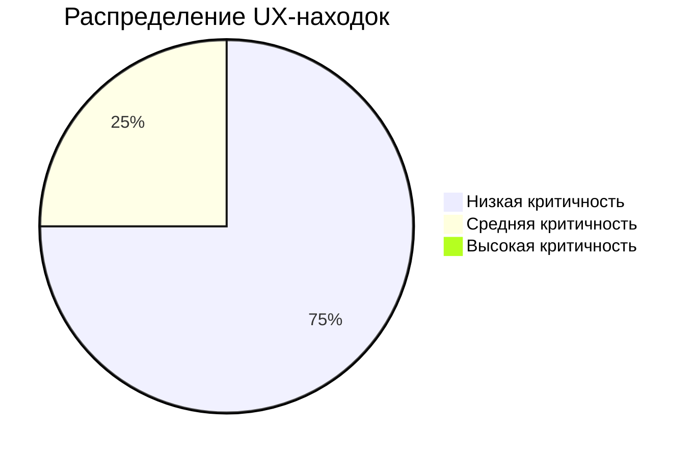

Рисунок 13. Распределение критичности UX-находок

**Расчет практического эффекта**

Расчет практического эффекта выполнен на основе результатов контрольных пользовательских сценариев и снижения времени ежедневного планирования и контроля задач. При усредненном сокращении 5–10 минут в день при 220 рабочих днях экономия составляет 18,3–36,7 часа в год. При принятой длительности рабочего дня 8 часов это эквивалентно 2,3–4,6 рабочего дня, что подтверждает практическую целесообразность внедрения.
Сводные численные оценки приведены в таблице 21.

Таблица 21. Расчет трудоемкости и эффекта

| Показатель | Значение | Комментарий |
|---|---|---|
| Экономия времени на планировании | 5–10 мин/день | Оценка по контрольным сценариям |
| Годовая экономия времени | 18,3–36,7 часа | 220 рабочих дней |
| Снижение доли просроченных задач | 10–15% | Ожидаемый эффект от сигналов риска |
| Увеличение устойчивости привычек | +3–5 дней streak | За счет визуализации прогресса |

Глоссарий терминов, пример аналитического отчета и перечень сокращений приведены в приложениях Е, Ж и З, что облегчает интерпретацию результатов и повторное использование методики.

## 4.5 Ограничения тестирования и направления дальнейшего развития

В этом подразделе фиксируются ограничения текущего тестирования и обозначаются направления развития.

По результатам разработки и проведенного тестирования системы определены направления дальнейшего развития.

Текущий контур тестирования ограничен стендовыми условиями и не включает длительные полевые испытания на расширенной пользовательской выборке, поэтому часть выводов по UX-эффекту и экономии времени носит ориентировочный характер. Автоматизированные проверки представлены базовым unit-тестом, а интеграционные тесты API пока не внедрены, что фиксируется как зона для дальнейшего развития.

При этом проведенная верификация подтверждает, что реализованный продукт Focus готов к практической эксплуатации в учебных и профессиональных сценариях и имеет потенциал масштабирования функциональности.

1. Углубление аналитического модуля. Переход от статических rule-based правил к адаптивным правилам с персонализированными весовыми коэффициентами на основе истории поведения пользователя. В перспективе — интеграция LSTM-модели для прогнозирования темпа выполнения.

2. Real-time взаимодействие. Внедрение WebSocket-канала для мгновенного обновления интерфейса при изменениях данных (актуально для синхронизации между устройствами).

3. Мобильный клиент. Разработка мобильного приложения на React Native с использованием общей кодовой базы бизнес-логики.

4. Расширение Telegram-интеграции. Добавление голосовых команд, напоминаний о дедлайнах, интерактивного ввода задач через мессенджер.

5. Расширение экосистемы интеграций. Интеграция с Google Calendar, Notion API и внешними issue-трекерами для импорта задач из сторонних источников.

## 4.6 Выводы раздела 4

В этом подразделе подводятся итоги тестирования и верификации.

В четвертой главе проведены тестирование и верификация разработанной системы. Подтверждено выполнение всех 9 функциональных требований (таблица 15), а нефункциональные характеристики (производительность, изоляция данных, адаптивность, качество кода) проверены по пунктам НФТ-1…НФТ-5 (таблица 17). Выполнены UX-проверка интерфейса и расчет практического эффекта (таблицы 20–21), после чего зафиксированы ограничения тестирования и направления дальнейшего развития системы. Для полноты защиты материалы приложений связаны с основной частью: сценарии — приложение А (таблица 23), API и технологический контур — приложение Б (таблицы 24–25), интерфейсные макеты — приложение В (рисунки 14–17), дополнительные потоки — приложение Г (рисунки 18–19), матрица экранов — приложение Д (таблица 26), глоссарий — приложение Е (таблица 27), пример отчета — приложение Ж (таблицы 28–29), перечень сокращений — приложение З. Тем самым формируется замкнутый контур «требования — реализация — проверка».

Дополнительно выполнена формальная трассировка «задачи ВКР — полученные результаты — подтверждающие материалы», представленная в таблице 22.

Таблица 22. Матрица трассируемости задач ВКР и полученных результатов

| Задача ВКР | Ключевой результат | Подтверждение в работе |
|---|---|---|
| Анализ предметной области и существующих решений | Выявлены ограничения текущих систем и обоснована ниша Focus | Разделы 1.1–1.2, таблица 1 |
| Обзор методов аналитики и выбор подхода | Обоснован выбор explainable rule-based подхода | Раздел 1.3, таблица 4 |
| Формирование требований к системе | Сформированы 9 функциональных и 5 нефункциональных требований | Раздел 1.4, рисунок 1, таблица 15, таблица 17 |
| Проектирование архитектуры и модели данных | Спроектированы архитектура и модель данных из 8 сущностей | Разделы 2.2–2.3, рисунки 3 и 4, таблица 8 |
| Реализация backend/frontend компонентов | Реализован полный контур REST API и пользовательского интерфейса | Разделы 3.1–3.2, рисунки 5 и 6, таблица 9 |
| Реализация интеллектуального модуля рекомендаций | Внедрен IntelligenceService с объяснимыми рекомендациями | Раздел 3.3, рисунок 9 |
| Тестирование и верификация результатов | Подтверждена функциональная полнота, НФТ и прикладная ценность | Раздел 4.1–4.4, таблицы 15–21 |

\newpage

# ЗАКЛЮЧЕНИЕ

## Итоги выполненного исследования

В этом подразделе подводятся итоги выполненной работы и формулируются ключевые достижения.

В выпускной квалификационной работе решена прикладная задача проектирования и реализации интеллектуальной системы Focus для персонального планирования и анализа продуктивности. Цель исследования достигнута: создан и верифицирован программный продукт, пригодный для практического использования.

По задаче 1 выполнен анализ предметной области персонального тайм-менеджмента, выявлены устойчивые проблемы пользователей и ограничения распространенных решений. Показано, что рассмотренные продукты (Todoist, Notion, ClickUp, Habitica) не закрывают одновременно операционный и аналитический контуры с объяснимой логикой рекомендаций.

По задаче 2 проведен обзор методов интеллектуальной аналитики для задач персональной продуктивности. Выбор rule-based подхода обоснован требованиями интерпретируемости, устойчивой работы при ограниченном объеме данных и соответствия принципам XAI.

По задаче 3 сформирован проверяемый набор из 9 функциональных и 5 нефункциональных требований, обеспечивший целостность проектных и реализационных решений.

По задаче 4 спроектирована клиент-серверная архитектура с разделением на 10 функциональных NestJS-модулей, разработана нормализованная реляционная модель данных на основе 8 доменных сущностей (User, Task, Habit, Note, Goal, FocusSession, ProductivityLog, UserEvent). Подготовлен расширенный комплект графических материалов:
- диаграмма вариантов использования (рисунок 1);
- дерево целей (рисунок 2);
- архитектурная схема (рисунок 3) и ER-диаграмма (рисунок 4);
- модульная структура backend (рисунок 5) и схема маршрутов frontend (рисунок 6);
- композиция дашборда (рисунок 7) и поток данных интерфейса (рисунок 8);
- диаграмма последовательности (рисунок 9), C4-контекст (рисунок 10) и deployment-диаграмма (рисунок 11);
- диаграмма пользовательского цикла (рисунок 12), распределение UX-находок (рисунок 13) и скриншоты интерфейса (рисунки 14–17).

По задаче 5 реализованы backend REST API с более чем 30 задокументированными endpoint-ами и frontend-приложение на Next.js с 9 ключевыми экранами (`/`, `/login`, `/dashboard`, `/kanban`, `/analytics`, `/goals`, `/focus`, `/notes`, `/settings`) и единым контуром визуализации данных.

По задаче 6 разработан интеллектуальный модуль IntelligenceService, реализующий 9 правил в 3 категориях, вычисляющий ProductivityScore и формирующий объяснимые рекомендации с текстовым обоснованием.

По задаче 7 проведены комплексные тесты и верификация системы. Подтверждено выполнение функциональных требований, а время отклика ключевых API-запросов не превышает 87 мс. Для frontend зафиксировано успешное прохождение lint/build, для backend — lint/build/test после генерации Prisma Client.

Итоговая полнота закрытия задач сведена в матрицу трассируемости (таблица 22), что дополнительно подтверждает логическую завершенность и внутреннюю согласованность ВКР.

## Основные результаты и выводы

В этом подразделе фиксируются основные результаты и итоговые выводы исследования.

Ключевым прикладным результатом работы стала разработанная и верифицированная система Focus, объединяющая:
- операционный контур (управление задачами, привычками, экспорт);
- аналитический контур (weekly/monthly аналитика, heatmap);
- рекомендательный контур (rule-based рекомендации с объяснением).

Отдельную исследовательскую ценность представляет реализованный комплекс расширенной аналитики: оценка риска выгорания, архетипирование пользовательского стиля, прогноз производительности и сценарное моделирование.

Разработанная система может применяться как самостоятельный инструмент персональной продуктивности в учебной и профессиональной деятельности, а также как технологическая платформа для дальнейшего развития адаптивных и предиктивных интеллектуальных сервисов. Итоговые выводы работы основаны на проверяемых результатах проектирования, реализации и тестирования Focus.

\newpage

# СПИСОК ИСПОЛЬЗОВАННЫХ ИСТОЧНИКОВ

1. Сабитов Ш.Р., Ахмедова А.М., Бурнашев Р.А., Кузнецова И.С. Методические указания по выполнению выпускной квалификационной работы. — Казань: КФУ, 2025.
2. ГОСТ Р 7.0.100–2018. Система стандартов по информации, библиотечному и издательскому делу. Библиографическая ссылка. Общие требования и правила составления. — М.: Стандартинформ, 2018.
3. ISO/IEC 25010:2011. Systems and Software Engineering — Systems and Software Quality Requirements and Evaluation (SQuaRE) — System and Software Quality Models. — ISO, 2011.
4. Next.js Documentation. Vercel Inc., 2024. URL: https://nextjs.org/docs (дата обращения: 14.05.2026).
5. NestJS Documentation. Kamil Mysliwiec, 2024. URL: https://docs.nestjs.com (дата обращения: 14.05.2026).
6. Prisma ORM Documentation. Prisma Inc., 2024. URL: https://www.prisma.io/docs (дата обращения: 14.05.2026).
7. Molnar C. Interpretable Machine Learning: A Guide for Making Black Box Models Explainable. 2nd ed. — 2022. URL: https://christophm.github.io/interpretable-ml-book (дата обращения: 14.05.2026).
8. Ribeiro M.T., Singh S., Guestrin C. "Why Should I Trust You?": Explaining the Predictions of Any Classifier // Proceedings of KDD-2016. — San Francisco, 2016. — P. 1135–1144.
9. Guidotti R., Monreale A., Ruggieri S. et al. A Survey of Methods for Explaining Black Box Models // ACM Computing Surveys. — 2019. — Vol. 51. — No. 5. — P. 1–42.
10. PostgreSQL 16 Documentation. PostgreSQL Global Development Group, 2024. URL: https://www.postgresql.org/docs/16 (дата обращения: 14.05.2026).
11. Newport C. Deep Work: Rules for Focused Success in a Distracted World. — New York: Grand Central Publishing, 2016. — 296 p.
12. Allen D. Getting Things Done: The Art of Stress-Free Productivity. Revised Edition. — New York: Penguin Books, 2015. — 352 p.
13. Recharts Documentation. Recharts Group, 2024. URL: https://recharts.org/en-US (дата обращения: 14.05.2026).
14. Docker Documentation. Docker Inc., 2024. URL: https://docs.docker.com (дата обращения: 14.05.2026).
15. ГОСТ 7.32–2017. Система стандартов по информации, библиотечному и издательскому делу. Отчет о научно-исследовательской работе. Структура и правила оформления. — М.: Стандартинформ, 2017.
16. Открытый исходный код и техническая документация проекта Focus (README.md). Репозиторий проекта, 2025.
17. TypeScript Documentation. Microsoft, 2024. URL: https://www.typescriptlang.org/docs (дата обращения: 17.05.2026).
18. Tailwind CSS Documentation. Tailwind Labs, 2024. URL: https://tailwindcss.com/docs (дата обращения: 17.05.2026).
19. SWR Documentation. Vercel Inc., 2024. URL: https://swr.vercel.app/docs (дата обращения: 17.05.2026).
20. shadcn/ui Documentation. shadcn, 2024. URL: https://ui.shadcn.com/docs (дата обращения: 17.05.2026).
21. class-validator Documentation. typestack, 2024. URL: https://github.com/typestack/class-validator (дата обращения: 17.05.2026).
22. Jest Documentation. OpenJS Foundation, 2024. URL: https://jestjs.io/docs/getting-started (дата обращения: 17.05.2026).
23. ESLint Documentation. OpenJS Foundation, 2024. URL: https://eslint.org/docs/latest (дата обращения: 17.05.2026).
24. OWASP API Security Top 10 – 2023. OWASP Foundation, 2023. URL: https://owasp.org/API-Security/editions/2023/en/0x00-header/ (дата обращения: 17.05.2026).

\newpage

# ПРИЛОЖЕНИЯ

## Приложение А. Описание ключевых пользовательских сценариев

В приложении А приведены функциональные сценарии, использованные при проверке системы.

Таблица 23. Функциональные сценарии системы Focus

| № | Сценарий | Участник | Предусловие | Ожидаемый результат |
|---|---|---|---|---|
| 1 | Регистрация нового пользователя | Анонимный пользователь | Открыта страница /login | Учетная запись создана, выполнен вход, выдан JWT |
| 2 | Создание задачи с дедлайном | Авторизованный пользователь | Открыт /dashboard (раздел задач) | Задача создана, отображается в списке и аналитике |
| 3 | Изменение статуса задачи | Авторизованный пользователь | Задача существует со статусом TODO | Статус обновлен, событие UserEvent зафиксировано |
| 4 | Фиксация выполнения привычки | Авторизованный пользователь | Привычка создана | Streak увеличен на 1, прогресс обновлен |
| 5 | Просмотр недельной аналитики | Авторизованный пользователь | Есть данные за период | График и метрики отображены корректно |
| 6 | Получение рекомендаций | Авторизованный пользователь | Есть задачи и привычки | Отображены рекомендации с обоснованием |
| 7 | Экспорт задач в CSV | Авторизованный пользователь | Есть задачи | Скачан файл tasks.csv с корректной структурой |
| 8 | Смена темы интерфейса | Авторизованный пользователь | Открыта страница /settings | Тема применена, предпочтение сохранено |

## Приложение Б. Структура API и технологический контур проекта

В приложении Б показаны доменная структура API и актуальный технологический контур проекта.

Таблица 24. Доменная структура backend REST API

| Домен | Endpoint-группа | Ключевые операции |
|---|---|---|
| Аутентификация | /auth | register, login, refresh, logout |
| Пользователи | /users | me, me (patch), me/password, me/stats |
| Задачи | /tasks | CRUD, upcoming, export, stats |
| Привычки | /habits | CRUD, track/untrack, stats |
| Аналитика | /analytics | overview, weekly, monthly, heatmap, recommendations, intelligence, burnout-index, archetype, velocity-forecast, focus-depth, habit-correlation, scenario-simulator |
| Цели | /goals | CRUD, прогресс, завершение |
| Заметки | /notes | CRUD, поиск |
| Фокус-сессии | /focus-sessions | история, статистика, сохранение сессий |
| События | /events | timeline, experiment-report |
| Telegram | /telegram | команды бота |

Технологический контур проекта с актуальными версиями зависимостей приведен в таблице 25.

Таблица 25. Используемые технологии и версии

| Компонент | Технология | Версия |
|---|---|---|
| Frontend-фреймворк | Next.js | 16.x |
| UI-язык | TypeScript | 5.x |
| CSS-утилиты | Tailwind CSS | 4.x |
| UI-компоненты | shadcn/ui | актуальная |
| Графики | Recharts | 3.x |
| Backend-фреймворк | NestJS | 11.x |
| ORM | Prisma | 6.x |
| База данных | PostgreSQL | 16 |
| Контейнеризация | Docker Compose | 2.x |
| Менеджер пакетов | npm | 10.x |

## Приложение В. Скриншоты пользовательского интерфейса

В приложении В собраны ключевые макеты интерфейса, иллюстрирующие основные экраны системы.

На рисунках 14–17 представлены схематичные макеты ключевых экранов пользовательского интерфейса Focus.

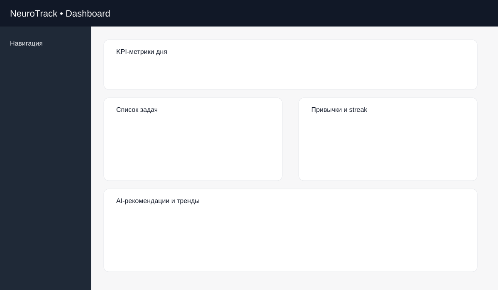

Рисунок 14. Схематичный макет дашборда с KPI и рекомендациями

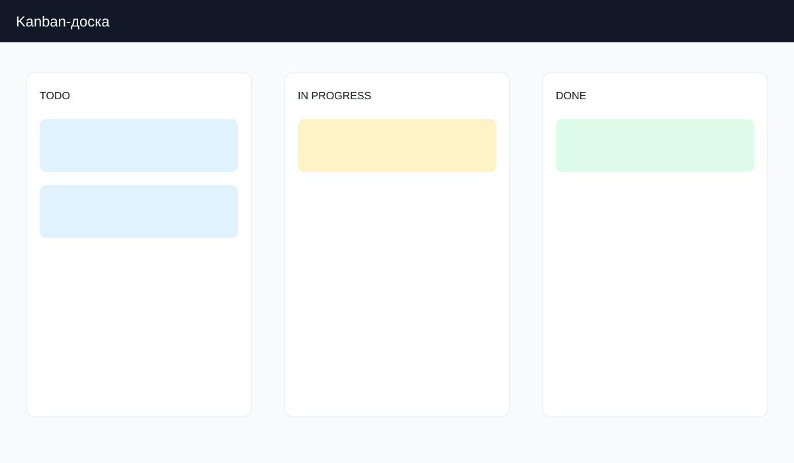

Рисунок 15. Схематичный макет канбан-доски со статусами задач

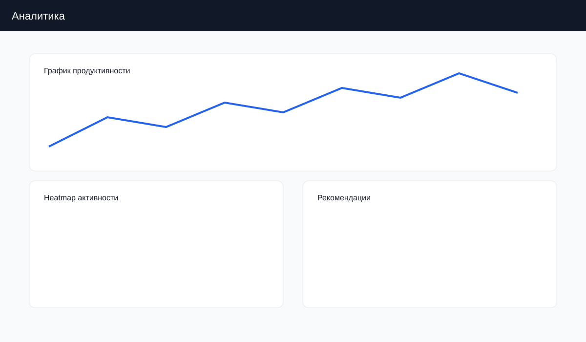

Рисунок 16. Схематичный макет экрана аналитики с графиком и heatmap

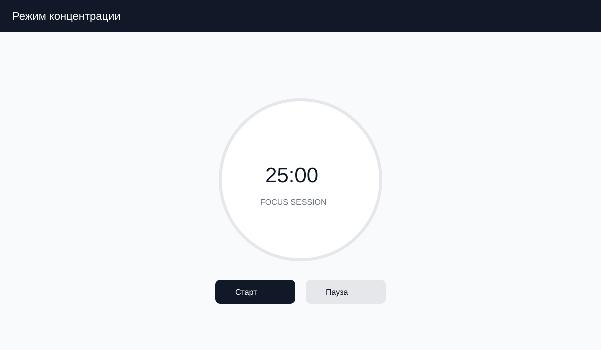

Рисунок 17. Схематичный макет экрана режима концентрации (Pomodoro)

## Приложение Г. Дополнительные пользовательские потоки

В приложении Г приведены дополнительные схемы пользовательских потоков для уточнения сценариев.

Ниже представлены дополнительные диаграммы последовательности и потока, уточняющие ключевые пользовательские сценарии.

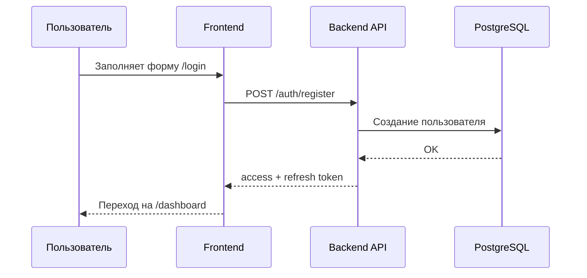

Рисунок 18. Последовательность регистрации пользователя

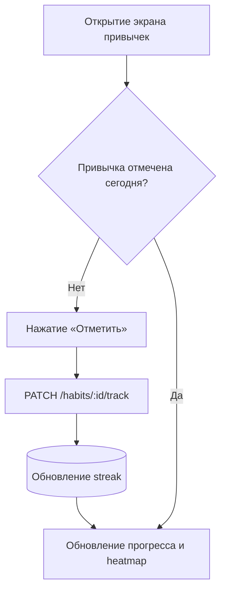

Рисунок 19. Поток фиксации привычки

## Приложение Д. Матрица соответствия экранов и требований

В приложении Д показано соответствие экранов интерфейса функциональным требованиям.

В таблице 26 представлено соответствие ключевых экранов интерфейса функциональным требованиям.

Таблица 26. Соответствие экранов и требований

| Экран | Функции | Требования |
|---|---|---|
| /login | Регистрация, вход, восстановление | ФТ-1 |
| /dashboard | KPI, задачи, привычки, рекомендации | ФТ-2, ФТ-4, ФТ-5, ФТ-7 |
| /kanban | Drag-and-drop управление задачами | ФТ-2 |
| /analytics | Heatmap, тренды, рекомендации | ФТ-5, ФТ-6, ФТ-7, ФТ-8 |
| /goals | Управление целями и прогрессом | ФТ-2 (расширение) |
| /focus | Pomodoro-таймер, фокус-сессии | ФТ-5 |
| /notes | Быстрые заметки | ФТ-2 (расширение) |
| /settings | Профиль, тема, безопасность | НФТ-4 |

## Приложение Е. Глоссарий и обозначения

В приложении Е собраны ключевые термины и обозначения, используемые в работе.

В таблице 27 приведен единый глоссарий ключевых терминов и сокращений, используемых в главах 1–4.

Таблица 27. Глоссарий ключевых терминов

| Термин | Определение |
|---|---|
| ProductivityScore | Интегральный индекс продуктивности пользователя (0–100) |
| Streak | Серия последовательных выполнений привычки |
| Heatmap | Тепловая карта активности по дням |
| KPI | Ключевой показатель эффективности (Key Performance Indicator) |
| Rule-based | Подход, основанный на правилах «если–то» |
| DeadlineAdherence | Доля задач, завершенных до дедлайна |
| FocusSession | Фиксированная сессия концентрации (Pomodoro) |
| What-if анализ | Сценарное моделирование изменения продуктивности |
| API Gateway | Промежуточный слой маршрутизации запросов |
| SSR | Серверный рендеринг страниц |
| DTO | Объект передачи данных с валидацией |
| JWT | JSON Web Token для аутентификации |
| C4-диаграмма | Контекстная диаграмма архитектуры системы |
| BurnoutIndex | Индекс когнитивной перегрузки |
| HabitStability | Метрика устойчивости привычек |
| Backlog | Список задач, ожидающих планирования |
| Kanban | Метод визуального управления задачами по статусам |
| Pomodoro | Техника фокусировки с интервалами работы и отдыха |
| SLA | Целевой уровень сервиса по времени ответа |
| Rate Limiting | Ограничение частоты запросов к API |
| Refresh Token | Долгоживущий токен обновления сессии |
| Access Token | Краткоживущий токен доступа к API |
| Идемпотентность | Свойство операции давать тот же результат при повторном вызове с теми же входными данными |
| ISR | Incremental Static Regeneration в Next.js |
| Skeleton UI | Заглушки интерфейса при загрузке |
| Idle Time | Период отсутствия активности пользователя |
| Session Timeout | Время автоматического выхода из сессии |
| Feature Toggle | Переключатель функциональности в UI |

## Приложение Ж. Пример аналитического отчета

В приложении Ж приведен пример аналитического отчета, который демонстрирует формат метрик.

Пример недельного отчета демонстрирует формат агрегированных метрик, используемых в разделе аналитики.

В таблице 28 представлена детализация недельной динамики пользовательской активности.

Таблица 28. Пример недельного отчета продуктивности

| День | Завершено задач | Фокус-минуты | Комментарий |
|---|---|---|---|
| Пн | 6 | 120 | Высокий темп, соблюдены дедлайны |
| Вт | 4 | 90 | Нормальный уровень активности |
| Ср | 3 | 60 | Низкая активность, риск прокрастинации |
| Чт | 7 | 150 | Пик продуктивности |
| Пт | 5 | 110 | Устойчивый темп |
| Сб | 2 | 45 | Низкая активность, рекомендован отдых |
| Вс | 1 | 30 | Минимальная активность |

В таблице 29 приведены сводные показатели недели, используемые для итоговой интерпретации результатов.

Таблица 29. Сводные показатели недели

| Показатель | Значение | Комментарий |
|---|---|---|
| Всего задач | 28 | Сумма за 7 дней |
| Завершено задач | 24 | Уровень завершения 86% |
| Средний streak | 6 дней | Устойчивость привычек |
| Средний ProductivityScore | 78 | Хороший уровень |
| Пиковый день | Четверг | Максимальная активность |
| Риск выгорания | Низкий | BurnoutIndex < 30 |

## Приложение З. Перечень сокращений

В приложении З приведен перечень используемых сокращений.

- AI — искусственный интеллект
- API — программный интерфейс приложения
- CRUD — операции создания, чтения, обновления, удаления
- DTO — объект передачи данных
- ER — Entity-Relationship диаграмма
- KPI — ключевой показатель эффективности
- SSR — серверный рендеринг
- UI/UX — пользовательский интерфейс и опыт
- JWT — JSON Web Token
- OWASP — Open Worldwide Application Security Project
- SWR — библиотека кеширования данных в React
- PWA — прогрессивное веб-приложение
