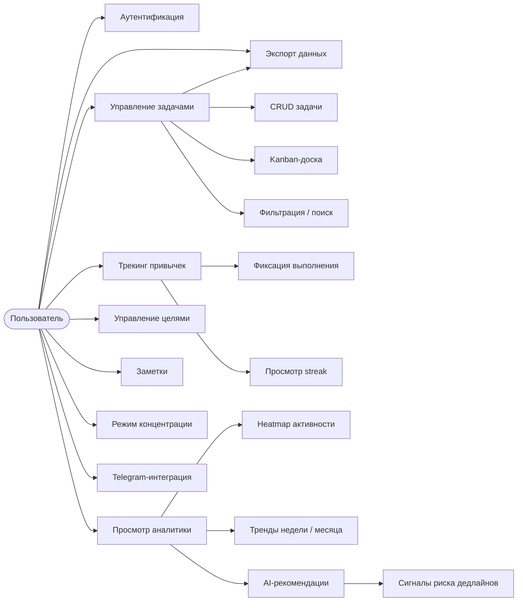
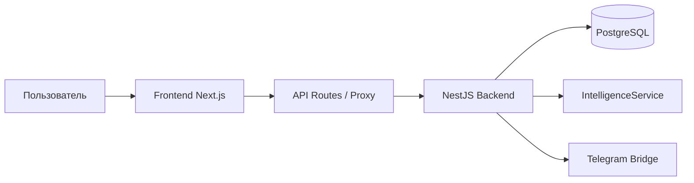
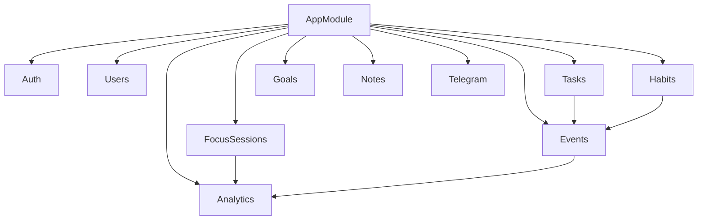
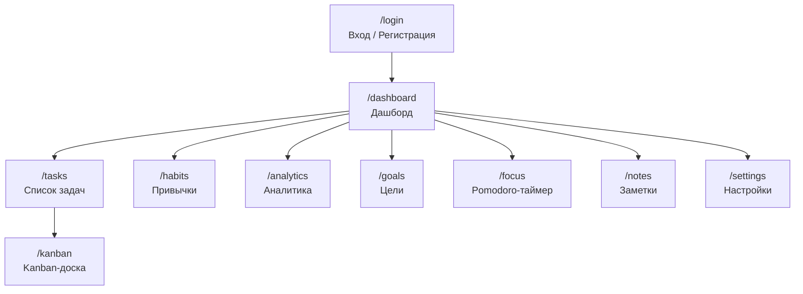
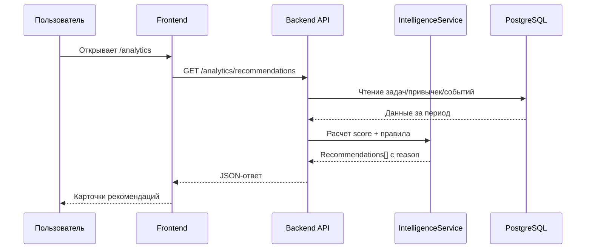
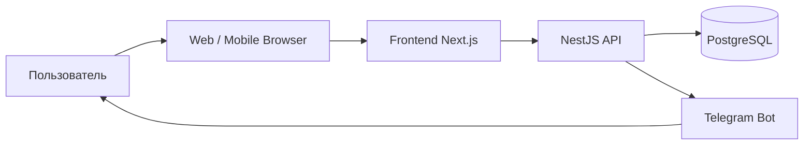
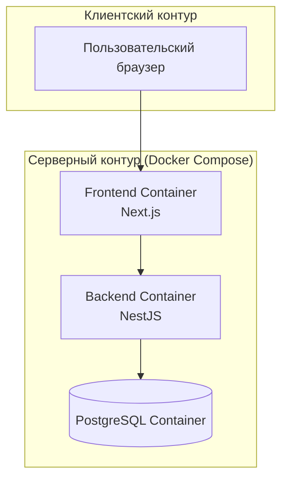
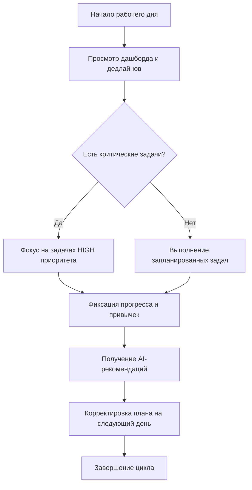

# ВЫПУСКНАЯ КВАЛИФИКАЦИОННАЯ РАБОТА

## Тема

Интеллектуальная система планирования и анализа продуктивности пользователя NeuroTrack

\newpage

# СОДЕРЖАНИЕ

Введение......................................................................................................................3

1 Анализ предметной области и постановка задачи...............................................7

1.1 Персональная продуктивность в цифровой среде: проблемы и вызовы......7

1.2 Анализ существующих программных решений и их ограничений.................9

1.3 Обзор методов интеллектуальной аналитики пользовательского поведения..13

1.4 Формирование требований к системе NeuroTrack........................................16

1.5 Постановка задачи ВКР...................................................................................19

1.6 Выводы раздела 1...........................................................................................20

2 Проектирование и реализация интеллектуальной системы NeuroTrack...........21

2.1 Обоснование выбора технологического стека..............................................21

2.2 Архитектура программной системы..............................................................24

2.3 Проектирование модели данных....................................................................27

2.4 Реализация backend-компонента системы......................................................31

2.5 Реализация frontend-компонента системы.....................................................35

2.6 Реализация интеллектуального модуля аналитики и рекомендаций..........38

2.7 Обеспечение безопасности и защиты данных...............................................42

2.8 Выводы раздела 2...........................................................................................44

3 Оценка результатов, качества и практической применимости..........................45

3.1 Методика оценки качества программного продукта....................................45

3.2 Проверка функциональной полноты системы...............................................47

3.3 Оценка нефункциональных характеристик...................................................49

3.4 Анализ практической применимости.............................................................51

3.5 Направления дальнейшего развития..............................................................53

3.6 Выводы раздела 3...........................................................................................54

Заключение.................................................................................................................55

Список использованных источников......................................................................57

Приложения................................................................................................................60

\newpage

# ВВЕДЕНИЕ

## Актуальность темы исследования

Цифровизация образовательной и профессиональной деятельности сопровождается ростом когнитивной нагрузки пользователя. По данным исследований в области управления вниманием, среднестатистический работник умственного труда отвлекается от основной задачи каждые 11 минут, а на восстановление концентрации требуется до 23 минут [11]. В условиях многозадачности пользователь вынужден одновременно поддерживать большой объем оперативной памяти: отслеживать актуальность задач, соблюдать дедлайны, управлять приоритетами и оценивать собственную эффективность.

Традиционные цифровые инструменты тайм-менеджмента — списки задач, канбан-доски, цифровые заметки — охватывают преимущественно операционный уровень: создание, хранение и организацию задач. Они слабо интегрированы между собой и не обеспечивают систематической поддержки принятия решений. Более продвинутые платформы (Notion, ClickUp, Asana) ориентированы преимущественно на командную работу и предлагают избыточный функционал для персонального использования [4], [5].

Одновременно развивается направление интеллектуальных помощников продуктивности — систем, анализирующих поведение пользователя и формирующих персонализированные рекомендации. Ключевой проблемой данного направления является баланс между точностью рекомендаций и их интерпретируемостью: рекомендации на основе нейронных сетей демонстрируют высокую точность, однако плохо поддаются объяснению [7], [8]. Rule-based системы, напротив, обеспечивают полную прозрачность логики при приемлемом качестве в типичных пользовательских сценариях [9].

Таким образом, разработка интегрированной веб-платформы NeuroTrack, объединяющей операционный контур управления задачами и привычками с аналитическим контуром объяснимых рекомендаций, является актуальной как в прикладном, так и в научно-методическом отношении.

## Степень разработанности темы

Область персонального планирования и управления продуктивностью активно исследуется в последнее десятилетие. В работах К. Ньюпорта [11] и Д. Аллена [12] сформированы концептуальные основы систем тайм-менеджмента — GTD (Getting Things Done) и Deep Work. С технологической стороны задача интеллектуальной аналитики пользовательского поведения рассматривается в работах по объяснимому искусственному интеллекту (XAI) [7], [8], [9].

В отечественной научно-технической литературе данная тематика находится на стадии формирования: большинство публикаций посвящены либо системам командного управления проектами, либо интеллектуальным помощникам общего назначения. Интегрированные системы персонального планирования с объяснимой аналитикой остаются малоисследованной нишей.

## Цель и задачи выпускной квалификационной работы

Цель выпускной квалификационной работы — разработать и обосновать интеллектуальную веб-систему NeuroTrack, обеспечивающую единый контур персонального планирования задач, трекинга привычек и анализа продуктивности с формированием объяснимых рекомендаций пользователю.

Для достижения цели поставлены задачи:

1. Выполнить анализ предметной области и существующих цифровых решений по управлению персональной продуктивностью, выявить их ограничения.
2. Провести обзор методов интеллектуальной аналитики и рекомендательных систем применительно к задачам персонального тайм-менеджмента.
3. Сформировать функциональные и нефункциональные требования к разрабатываемой системе.
4. Спроектировать архитектуру клиент-серверного приложения и модель данных.
5. Реализовать backend- и frontend-компоненты с учетом требований безопасности, типобезопасности и масштабируемости.
6. Реализовать rule-based модуль интеллектуальной аналитики и рекомендаций.
7. Оценить качество, функциональную полноту и практическую применимость разработанной системы.

## Объект и предмет исследования

Объект исследования — процессы персонального планирования, контроля выполнения задач и оценки продуктивности пользователя в цифровой среде.

Предмет исследования — методы, модели и программные средства построения интеллектуальных информационных систем поддержки персональной эффективности.

## Научная новизна и практическая значимость

Научная новизна работы определяется следующим: предложена архитектурная модель, интегрирующая операционный и аналитический контуры персональной продуктивности в единой системе, где пользовательские события (задачи, привычки, активность) выступают как связанные источники данных для explainable-рекомендательной подсистемы.

Практическая значимость работы состоит в создании функционирующего программного продукта, обеспечивающего:
- сокращение времени на ежедневное планирование за счет автоматизации приоритизации;
- повышение прозрачности пользовательской продуктивности через агрегированную аналитику;
- целенаправленное развитие персональных привычек через трекинг и streak-механизм.

## Структура работы

Работа состоит из введения, трех глав, заключения, списка использованных источников и двух приложений. Первая глава посвящена аналитическому исследованию предметной области и постановке задачи. Вторая глава описывает архитектурные решения, проектирование и реализацию системы. Третья глава содержит оценку результатов, качества и практической применимости разработки.

\newpage

# 1 Анализ предметной области и постановка задачи

## 1.1 Персональная продуктивность в цифровой среде: проблемы и вызовы

Под персональной продуктивностью понимается способность индивида систематически достигать поставленных целей при рациональном использовании временных и когнитивных ресурсов [12]. В цифровой среде это понятие приобретает дополнительные измерения: информационная перегрузка, многоканальность коммуникации и постоянная доступность создают условия, принципиально отличающиеся от традиционного рабочего контекста.

Исследования в области когнитивной психологии и управления вниманием выделяют несколько ключевых проблем:

1. Фрагментация инструментального контура. Пользователь, как правило, вынужден работать одновременно с несколькими несвязанными приложениями: планировщиком задач, трекером времени, заметочником, календарем. Переключение между системами создает накладные расходы и снижает ментальную модель состояния задач [11].

2. Неравномерность нагрузки. Без аналитической поддержки пользователь субъективно оценивает свою нагрузку и нередко допускает систематическое откладывание сложных задач (прокрастинацию). При этом объективные данные о темпе выполнения и динамике просрочек остаются скрытыми.

3. Низкая устойчивость привычек. Формирование новой привычки требует регулярного подкрепления в течение 21–66 дней [12]. Инструменты, не обеспечивающие наглядного контроля серии выполнения (streak), в значительной мере утрачивают мотивационное воздействие.

4. Отсутствие объяснимой обратной связи. Большинство современных решений предлагают описательную статистику (графики выполненных задач, распределение по приоритетам), однако не дают пользователю ответа на вопрос «почему» и «что делать дальше» [8].

Совокупность перечисленных проблем обосновывает необходимость разработки системы с интегрированным аналитическим контуром, обеспечивающей единый цифровой поток от постановки задачи до объяснимой оценки эффективности.

## 1.2 Анализ существующих программных решений и их ограничений

Анализ рынка позволяет выделить несколько классов цифровых инструментов продуктивности:
- task-менеджеры (Todoist, Things 3, OmniFocus);
- канбан-доски (Trello, Linear, Jira);
- комплексные рабочие пространства (Notion, ClickUp, Obsidian);
- специализированные трекеры времени и привычек (Toggl, Habitica, Streaks).

В таблице 1.1 приведено сравнение характеристик наиболее распространенных решений по критериям, релевантным целям настоящего исследования.

Таблица 1.1. Сравнительный анализ существующих решений

| Характеристика | Todoist | Notion | ClickUp | Habitica | NeuroTrack (разрабатываемая) |
|---|---|---|---|---|---|
| Управление задачами (CRUD + приоритеты + дедлайны) | + | + | + | ограниченно | + |
| Встроенный трекинг привычек | — | — | — | + | + |
| Streak-механизм | — | — | — | + | + |
| Аналитика продуктивности | базовая | — | базовая | базовая | расширенная |
| Объяснимые рекомендации | — | — | — | — | + |
| Heatmap активности | — | — | — | — | + |
| Telegram-интеграция | — | — | — | — | + |
| Экспорт данных (JSON/CSV) | — | + (PDF) | + | — | + |
| Адаптивный интерфейс | + | + | + | + | + |
| Dark mode | + | + | + | + | + |
| Open source / self-hosted | — | — | — | — | + |

Из таблицы 1.1 видно, что ни одно из рассмотренных решений не объединяет в полной мере функции трекинга задач, привычек и объяснимой аналитики. Каждое решение специализируется на отдельной области, что подтверждает актуальность разработки интегрированной системы.

Рассмотрим ограничения ключевых решений подробнее.

Todoist является одним из наиболее зрелых task-менеджеров с развитой системой ярлыков и фильтров [4]. Однако аналитическая часть продукта в бесплатном тарифе ограничена счетчиком завершенных задач за день, без построения трендов или рекомендаций. Integrations with third-party analytics tools требуют Pro-подписки.

Notion предоставляет гибкое рабочее пространство с возможностью создания баз данных, kanban-досок и вики-страниц. Тем не менее, Notion не является системой управления продуктивностью в строгом смысле: построение аналитических дашбордов требует значительной ручной настройки, а трекинг привычек не реализован «из коробки» [5].

ClickUp позиционируется как all-in-one инструмент управления проектами. Для персонального использования ClickUp избыточен: интерфейс перегружен, onboarding сложен, а встроенная аналитика ориентирована на командные показатели, а не на персональные паттерны продуктивности.

Habitica геймифицирует трекинг привычек и задач через механику RPG. При наличии streak-механизма аналитика продуктивности в системе отсутствует, а интеграция с внешними сервисами ограничена.

## 1.3 Обзор методов интеллектуальной аналитики пользовательского поведения

Задача формирования рекомендаций по повышению продуктивности может быть формализована как задача классификации состояния пользователя и выработки корректирующего действия на основе поведенческих данных. В современной литературе выделяется несколько подходов [7], [8], [9].

Подход 1. Rule-based системы. Рекомендации формируются на основе набора явно заданных правил вида «ЕСЛИ условие ТОГДА действие». Преимущества: полная интерпретируемость, воспроизводимость, простота отладки. Ограничения: необходимость ручного проектирования правил, сложность масштабирования на большое число условий [9].

Подход 2. Коллаборативная фильтрация. Система рекомендует действия на основе сравнения поведения текущего пользователя с похожими профилями. Требует накопленной базы пользователей и не применима в персональных системах без агрегированных данных.

Подход 3. Обучение с подкреплением (RL). Агент обучается оптимальной политике рекомендаций через обратную связь пользователя. Демонстрирует высокое качество в долгосрочной перспективе, однако требует значительного объема данных на стадии обучения [8].

Подход 4. Нейросетевые модели (LSTM, Transformer). Обеспечивают учет долгосрочных временных зависимостей в поведении пользователя. Основной недостаток — низкая интерпретируемость предсказаний («черный ящик») [7].

Для настоящей работы выбран подход rule-based систем как наиболее соответствующий требованиям интерпретируемости и применимый в условиях ограниченного объема данных одного пользователя. Данный выбор согласуется с принципами Explainable AI (XAI), нашедшими отражение в работах Molnar [7] и Ribeiro [8].

В таблице 1.2 приведено сравнение подходов по ключевым критериям.

Таблица 1.2. Сравнение подходов к формированию рекомендаций

| Критерий | Rule-based | Collaborative filtering | Reinforcement learning | Deep learning |
|---|---|---|---|---|
| Интерпретируемость | Высокая | Средняя | Низкая | Низкая |
| Необходимый объем данных | Малый | Большой (коллективный) | Большой | Большой |
| Качество при малом объеме данных | Высокое | Низкое | Низкое | Низкое |
| Скорость внедрения | Высокая | Средняя | Низкая | Низкая |
| Расширяемость | Средняя | Высокая | Высокая | Высокая |
| Применимость в ВКР-прототипе | Оптимальна | Неприменима | Ограничена | Ограничена |

## 1.4 Формирование требований к системе NeuroTrack

На основе анализа предметной области, ограничений существующих решений и формальных требований к структуре и оформлению ВКР [1], [15] сформирован следующий набор требований.

Функциональные требования (ФТ):

ФТ-1. Система должна поддерживать регистрацию, аутентификацию и управление сессией пользователя на основе JWT access/refresh токенов.

ФТ-2. Система должна обеспечивать полный CRUD задач с атрибутами: заголовок, описание, приоритет (низкий / средний / высокий), статус (к выполнению / в процессе / выполнено), дедлайн, метки.

ФТ-3. Система должна поддерживать экспорт задач в форматах JSON и CSV.

ФТ-4. Система должна реализовывать управление привычками с отображением streak-показателей и визуализацией прогресса выполнения.

ФТ-5. Система должна формировать еженедельную и ежемесячную аналитику продуктивности с отображением: количества завершенных задач, распределения нагрузки по дням, динамики streak.

ФТ-6. Система должна строить тепловую карту (heatmap) активности пользователя по дням.

ФТ-7. Система должна генерировать объяснимые рекомендации на основе rule-based логики с текстовым обоснованием каждой рекомендации.

ФТ-8. Система должна рассчитывать и отображать сигналы риска срыва дедлайнов для активных задач.

ФТ-9. Система должна предоставлять базовую Telegram-интеграцию для получения списка задач и ежедневного отчета.

Нефункциональные требования (НФТ):

НФТ-1. Архитектура системы должна быть модульной с разделением ответственности между слоями (controller/service/repository).

НФТ-2. Все пользовательские данные должны храниться в изолированном контексте; межпользовательский доступ к данным недопустим.

НФТ-3. Время отклика API для типовых операций не должно превышать 500 мс.

НФТ-4. Интерфейс должен поддерживать адаптивную верстку (desktop / tablet / mobile) и темную тему.

НФТ-5. Кодовая база должна проходить статический анализ (lint) и автоматическую сборку без ошибок.

Совокупность функциональных сценариев системы NeuroTrack, соответствующих сформированным требованиям, представлена на рисунке 1.1 в виде диаграммы вариантов использования.



Рисунок 1.1. Диаграмма вариантов использования системы NeuroTrack

## 1.5 Постановка задачи ВКР

На основе проведенного анализа задача ВКР формулируется следующим образом: необходимо спроектировать и реализовать интеллектуальную веб-систему NeuroTrack, обеспечивающую единый программный контур персонального планирования, трекинга привычек и объяснимой аналитики продуктивности.

Для решения задачи требуется:
1. Выбрать технологический стек, обеспечивающий типобезопасность, модульность и скорость разработки.
2. Спроектировать реляционную модель данных, обеспечивающую корректную изоляцию пользовательских данных.
3. Реализовать REST API с полным набором доменных endpoint-ов и документацией Swagger.
4. Разработать пользовательский интерфейс с дашбордом, аналитикой, задачами и привычками.
5. Реализовать rule-based аналитический движок и продемонстрировать корректность его работы на контрольных сценариях.

## 1.6 Выводы раздела 1

В первой главе выполнен анализ предметной области персонального планирования и управления продуктивностью. Установлено, что существующие решения не обеспечивают интеграцию операционного контура (задачи, привычки) с аналитическим контуром (тренды, объяснимые рекомендации). Проведен обзор методов интеллектуальной аналитики; для настоящей работы обоснован выбор rule-based подхода с учетом требований интерпретируемости. Сформированы функциональные и нефункциональные требования, которые используются как основа для проектирования системы в следующей главе.

\newpage

# 2 Проектирование и реализация интеллектуальной системы NeuroTrack

## 2.1 Обоснование выбора технологического стека

Выбор технологического стека определялся следующими критериями: зрелость экосистемы, наличие TypeScript-поддержки, совместимость с модульной архитектурой, скорость разработки и широкая база документации.

В таблице 2.1 приведено сравнение рассматривавшихся альтернатив по ключевым технологическим решениям.

Таблица 2.1. Обоснование выбора компонентов стека

| Компонент | Рассматривавшиеся варианты | Выбранное решение | Обоснование |
|---|---|---|---|
| Frontend-фреймворк | React (CRA), Vite+React, Next.js | Next.js 16 | Server Components, файловая маршрутизация, производительность |
| Язык | JavaScript, TypeScript | TypeScript | Статическая типизация, улучшение поддерживаемости |
| UI-библиотека | Chakra UI, MUI, shadcn/ui | Tailwind CSS + shadcn/ui | Гибкость, малый бандл, компонентная архитектура |
| Графики | Chart.js, Victory, Recharts | Recharts | Нативная поддержка React, декларативный API [13] |
| Backend-фреймворк | Express.js, Fastify, NestJS | NestJS | Модульность, встроенные декораторы, DI-контейнер [5] |
| ORM | TypeORM, Sequelize, Prisma | Prisma | Типобезопасность, автогенерация клиента, миграции [6] |
| База данных | MySQL, SQLite, PostgreSQL | PostgreSQL 16 | Производительность, JSONB, полнотекстовый поиск [10] |
| Аутентификация | Sessions+Cookies, Passport.js, custom JWT | Custom JWT + httpOnly cookies | Контроль реализации, безопасность |
| Контейнеризация | Docker, Podman | Docker Compose | Стандарт индустрии, удобство локальной разработки [14] |
| API-документация | Redoc, Swagger | Swagger/OpenAPI | Интерактивная документация, автогенерация из декораторов |

Итоговый стек системы:
- Frontend: Next.js, TypeScript, Tailwind CSS, shadcn/ui, Recharts [4], [13];
- Backend: NestJS, Prisma ORM, PostgreSQL [5], [6], [10];
- Безопасность: JWT access/refresh, httpOnly cookies, bcrypt, Rate Limiting;
- Инфраструктура: Docker и Docker Compose [14].

## 2.2 Архитектура программной системы

Архитектура системы построена по клиент-серверной модели с четкой сегментацией ответственности между слоями. Общая архитектурно-технологическая схема представлена на рисунке 2.1. Принципиальная схема системы включает следующие уровни:

1. Клиентский слой (Frontend) — браузерное приложение, реализующее пользовательский интерфейс, состояние сессии, обращение к API и визуализацию данных.

2. API-шлюз (Next.js API Routes) — промежуточный слой, выполняющий трансляцию запросов браузера к backend-сервисам, управление cookie-сессией и логику SSR.

3. Backend-слой (NestJS) — ядро системы, реализующее бизнес-логику, авторизацию, валидацию, агрегацию данных и взаимодействие с базой данных.

4. Слой данных (PostgreSQL + Prisma) — реляционное хранилище с типобезопасным ORM-клиентом.

5. Аналитический модуль — автономный сервис внутри backend, реализующий rule-based логику рекомендаций и оценку риска.

6. Telegram Bridge — интеграционный модуль, обеспечивающий двустороннее взаимодействие с мессенджером.



Рисунок 2.1. Архитектурно-технологическая схема системы NeuroTrack

Backend-часть реализует паттерн «модульная монолитная архитектура» (modular monolith). Доменные области (auth, users, tasks, habits, analytics, events, goals, notes, focus-sessions, telegram) оформлены как самостоятельные NestJS-модули со следующей внутренней структурой:
- Controller — обработка HTTP-запросов, парсинг и передача в Service;
- Service — бизнес-логика, оркестрация операций;
- Repository (через Prisma) — доступ к данным.

Такое разделение обеспечивает тестируемость на уровне unit-тестов для Service-слоя и integration-тестов для Controller-слоя.

Взаимодействие между frontend и backend осуществляется через REST API с JSON-телами запросов. Аутентификация реализована через httpOnly cookie с access token (TTL 15 минут) и механизм обновления через refresh token (TTL 7 дней). Для безопасной передачи используется HTTPS в production-окружении.

## 2.3 Проектирование модели данных

Реляционная модель данных разрабатывалась из принципов минимальной избыточности, корректной нормализации (3НФ) и возможности эффективной аналитической агрегации. Модель включает 8 сущностей: User, Task, Habit, Note, Goal, FocusSession, ProductivityLog и UserEvent. Полная ER-диаграмма, отражающая все сущности и их связи, приведена на рисунке 2.2.

В таблице 2.2 описаны все сущности модели данных с указанием атрибутов и их типов.

Таблица 2.2. Описание сущностей модели данных

| Сущность | Атрибут | Тип | Описание |
|---|---|---|---|
| User | id | String (PK) | Первичный ключ (CUID) |
| User | email | String (unique) | Электронная почта |
| User | passwordHash | String | Bcrypt-хеш пароля (cost factor 12) |
| User | refreshTokenHash | String? | Хеш refresh-токена (хранится на уровне записи пользователя) |
| User | name | String? | Имя пользователя |
| User | createdAt | DateTime | Дата регистрации |
| Task | id | String (PK) | Первичный ключ (CUID) |
| Task | userId | String (FK) | Связь с пользователем |
| Task | title | String | Заголовок задачи |
| Task | description | String? | Описание |
| Task | priority | Enum | LOW / MEDIUM / HIGH |
| Task | status | Enum | TODO / IN\_PROGRESS / DONE |
| Task | deadline | DateTime? | Дедлайн |
| Task | tags | String[] | Массив тегов |
| Task | subtasks | JSON | Подзадачи в формате JSON |
| Task | completedAt | DateTime? | Время завершения |
| Task | createdAt | DateTime | Время создания |
| Habit | id | String (PK) | Первичный ключ (CUID) |
| Habit | userId | String (FK) | Связь с пользователем |
| Habit | name | String | Название привычки |
| Habit | streak | Int | Текущая серия выполнений |
| Habit | completedDays | JSON | Массив дат выполнения |
| Habit | createdAt | DateTime | Дата создания |
| Note | id | String (PK) | Первичный ключ (CUID) |
| Note | userId | String (FK) | Связь с пользователем |
| Note | title | String | Заголовок заметки |
| Note | content | String | Текст заметки (Markdown) |
| Note | mood | String? | Настроение / эмодзи-метка |
| Note | color | String | Цвет карточки (HEX) |
| Note | pinned | Boolean | Признак закреплённой заметки |
| Note | tags | String[] | Массив тегов |
| Note | createdAt | DateTime | Дата создания |
| Goal | id | String (PK) | Первичный ключ (CUID) |
| Goal | userId | String (FK) | Связь с пользователем |
| Goal | title | String | Название цели |
| Goal | category | String | Категория (personal / work / health и др.) |
| Goal | target | Float | Целевое значение |
| Goal | current | Float | Текущий прогресс |
| Goal | unit | String | Единица измерения (%, задача, км и др.) |
| Goal | deadline | DateTime? | Срок достижения |
| Goal | completed | Boolean | Признак завершения |
| Goal | color | String | Цвет визуализации |
| Goal | createdAt | DateTime | Дата создания |
| FocusSession | id | String (PK) | Первичный ключ (CUID) |
| FocusSession | userId | String (FK) | Связь с пользователем |
| FocusSession | phase | String | Фаза (focus / short\_break / long\_break) |
| FocusSession | taskTitle | String? | Название задачи в сессии |
| FocusSession | durationMin | Int | Длительность сессии (мин) |
| FocusSession | completedAt | DateTime | Время завершения сессии |
| ProductivityLog | id | String (PK) | Первичный ключ (CUID) |
| ProductivityLog | userId | String (FK) | Связь с пользователем |
| ProductivityLog | date | DateTime | Дата записи (один лог на день на пользователя) |
| ProductivityLog | completedTasksCount | Int | Количество выполненных задач за день |
| ProductivityLog | activeMinutes | Int | Минуты активной работы (фокус-сессии) |
| ProductivityLog | createdAt | DateTime | Дата создания |
| UserEvent | id | String (PK) | Первичный ключ (CUID) |
| UserEvent | userId | String (FK) | Связь с пользователем |
| UserEvent | type | Enum | Тип события: TASK\_CREATED, TASK\_COMPLETED, HABIT\_TRACKED, FOCUS\_SESSION\_COMPLETED и др. |
| UserEvent | payload | JSON | Контекстные данные события |
| UserEvent | occurredAt | DateTime | Время события |

Связи между сущностями реализуют паттерн «один ко многим»: один пользователь владеет множеством задач, привычек, событий и токенов обновления. Каскадное удаление настроено на уровне Prisma-схемы: при удалении пользователя автоматически удаляются все связанные записи.

Индексная стратегия включает:
- индекс по userId в таблицах Task, Habit, UserEvent для оптимизации выборок;
- составной индекс (userId, status) в таблице Task для фильтрации по статусу;
- индекс по occurredAt в таблице UserEvent для временных агрегаций.


Рисунок 2.2. ER-диаграмма модели данных системы NeuroTrack (8 сущностей)

Связи между сущностями реализуют паттерн «один ко многим»: один пользователь владеет множеством задач, привычек, заметок, целей, фокус-сессий и событий. Каскадное удаление настроено на уровне Prisma-схемы: при удалении пользователя автоматически удаляются все связанные записи.

Индексная стратегия включает:
- составной индекс `(userId, status)` в таблице Task для оптимизации фильтрации по статусу;
- составной индекс `(userId, date)` в таблице ProductivityLog для быстрых временных агрегаций;
- индекс по `userId` во всех пользовательских таблицах для оптимизации выборок;
- индекс по `(userId, pinned)` в таблице Note для быстрого доступа к закреплённым заметкам;
- индекс по `deadline` в таблице Task для запросов ближайших дедлайнов.

Backend реализован на NestJS и организован в 10 функциональных модулей: Auth, Users, Tasks, Habits, Analytics, Events, Goals, Notes, FocusSessions и Telegram.

Модуль Auth реализует полный цикл аутентификации:
- POST /auth/register — регистрация с валидацией email и хешированием пароля через bcrypt (cost factor 12);
- POST /auth/login — аутентификация, выдача access token и установка refresh token в httpOnly cookie;
- POST /auth/refresh — обновление access token по refresh token;
- POST /auth/logout — инвалидация refresh token в базе данных.

Модуль Tasks реализует управление задачами:
- GET /tasks — список задач с фильтрацией по статусу, приоритету и дедлайну;
- POST /tasks — создание задачи с валидацией DTO;
- GET /tasks/:id — детали задачи;
- PATCH /tasks/:id — частичное обновление задачи;
- DELETE /tasks/:id — мягкое или жесткое удаление;
- GET /tasks/upcoming — задачи с дедлайном в ближайшие 24 часа;
- GET /tasks/export — экспорт в JSON или CSV.

Модуль Habits реализует управление привычками:
- CRUD для сущности Habit;
- POST /habits/:id/complete — фиксация выполнения привычки за день с автоматическим пересчетом streak;
- GET /habits/stats — агрегированная статистика по всем привычкам.

Модуль Analytics предоставляет аналитические данные:
- GET /analytics/overview — сводная статистика (выполненные задачи, активные задачи, streak привычек);
- GET /analytics/weekly — детальный отчет по неделям;
- GET /analytics/monthly — детальный отчет по месяцам;
- GET /analytics/heatmap — данные тепловой карты активности;
- GET /analytics/recommendations — рекомендации с обоснованием.

- GET /analytics/intelligence — адаптивное планирование и explainable-score с учетом уровня энергии;
- GET /analytics/experiment-report — сравнительный отчет «до/после» (окно 7+7 дней);
- GET /analytics/trends — межнедельные тренды эффективности;
- GET /analytics/focus-depth — индекс глубины фокуса по сессиям;
- GET /analytics/scenario-simulator — what-if моделирование изменения продуктивности.

Структура backend-модулей и их взаимодействие в модульном монолите представлена на рисунке 2.3.



Рисунок 2.3. Модульная структура backend-ядра NeuroTrack

В таблице 2.3 приведено описание ключевых API-endpoint-ов с HTTP-методами и кодами ответа.

Таблица 2.3. Реестр ключевых API-endpoint-ов

| Endpoint | Метод | Авторизация | Описание | Успешный ответ |
|---|---|---|---|---|
| /auth/register | POST | — | Регистрация пользователя | 201 Created |
| /auth/login | POST | — | Вход в систему | 200 OK |
| /auth/refresh | POST | Cookie | Обновление токена | 200 OK |
| /auth/logout | POST | Bearer | Выход из системы | 200 OK |
| /tasks | GET | Bearer | Список задач с фильтрами | 200 OK |
| /tasks | POST | Bearer | Создание задачи | 201 Created |
| /tasks/:id | PATCH | Bearer | Обновление задачи | 200 OK |
| /tasks/:id | DELETE | Bearer | Удаление задачи | 204 No Content |
| /tasks/upcoming | GET | Bearer | Задачи с дедлайном 24ч | 200 OK |
| /tasks/export | GET | Bearer | Экспорт задач (JSON/CSV) | 200 OK |
| /habits | GET | Bearer | Список привычек | 200 OK |
| /habits/:id/complete | POST | Bearer | Фиксация выполнения | 200 OK |
| /habits/stats | GET | Bearer | Статистика привычек | 200 OK |
| /analytics/overview | GET | Bearer | Сводная аналитика | 200 OK |
| /analytics/heatmap | GET | Bearer | Тепловая карта | 200 OK |
| /analytics/recommendations | GET | Bearer | AI-рекомендации | 200 OK |
| /user/profile | GET | Bearer | Профиль пользователя | 200 OK |
| /user/password | PATCH | Bearer | Смена пароля | 200 OK |
| /goals | GET | Bearer | Список целей | 200 OK |
| /goals | POST | Bearer | Создание цели | 201 Created |
| /notes | GET | Bearer | Список заметок | 200 OK |
| /notes | POST | Bearer | Создание заметки | 201 Created |
| /focus-sessions | GET | Bearer | История фокус-сессий | 200 OK |
| /focus-sessions | POST | Bearer | Сохранение фокус-сессии | 201 Created |
| /events | GET | Bearer | Лента событий пользователя | 200 OK |
| /analytics/intelligence | GET | Bearer | Адаптивная аналитика | 200 OK |

Все endpoint-ы задокументированы через Swagger/OpenAPI с использованием NestJS-декораторов @ApiOperation, @ApiResponse и @ApiBearerAuth [16].

## 2.5 Реализация frontend-компонента системы

Frontend-приложение реализовано на Next.js с использованием App Router. Структура маршрутов приложения включает следующие ключевые страницы:

1. /login — форма входа и регистрации с валидацией на стороне клиента.
2. /dashboard — главный экран с виджетами продуктивности, списком ближайших задач, streak привычек и блоком AI-рекомендаций.
3. /tasks — полный список задач с фильтрацией, сортировкой и inline-редактированием.
4. /kanban — канбан-доска с drag-and-drop перетаскиванием задач между колонками статусов.
5. /habits — список привычек с прогресс-барами и кнопкой фиксации выполнения.
6. /analytics — дашборд аналитики с графиками, heatmap и детализацией по периодам.
7. /goals — экран целей с декомпозицией на подзадачи.
8. /focus — таймер режима концентрации (Pomodoro-режим).
9. /notes — быстрые заметки.
10. /settings — настройки профиля, темы, уведомлений.

Структура маршрутов и логика навигации между экранами представлены на рисунке 2.4.



Рисунок 2.4. Схема маршрутов frontend-приложения NeuroTrack

Компонентная архитектура Frontend разделена на три уровня:
- страницы (Page components) — маршрутные компоненты, оркестрирующие загрузку данных;
- составные компоненты (Compound components) — функциональные блоки (TaskCard, HabitRow, AnalyticsChart);
- атомарные компоненты (Atoms) — переиспользуемые элементы UI из shadcn/ui (Button, Input, Badge, Dialog).

Визуализация данных реализована через библиотеку Recharts [13]:
- LineChart — динамика выполненных задач по неделям и месяцам;
- BarChart — распределение задач по приоритетам;
- AreaChart — тренд производительности;
- CalendarHeatmap — тепловая карта активности по дням.

Управление состоянием реализовано через React Context API и SWR для кеширования запросов к API с автоматической ревалидацией. Темизация основана на CSS-переменных Tailwind с поддержкой system/light/dark режима.

## 2.6 Реализация интеллектуального модуля аналитики и рекомендаций

Интеллектуальный модуль является ключевым аналитическим компонентом системы. Он реализован в виде отдельного NestJS-сервиса (IntelligenceService) и обрабатывает следующие входные данные:
- задачи пользователя (статус, приоритет, дедлайн, дата создания);
- привычки пользователя (streak, частота, дни выполнения);
- события пользователя (UserEvent) за последние 30 дней;
- агрегированную статистику из аналитического модуля.

На основе входных данных модуль вычисляет ProductivityScore — комплексный показатель продуктивности пользователя (0–100), рассчитываемый по формуле:

```
ProductivityScore = w1 * TaskCompletionRate + w2 * HabitStability + w3 * DeadlineAdherence
```

где TaskCompletionRate — доля завершенных задач за период; HabitStability — средний streak по привычкам (нормированный); DeadlineAdherence — доля задач, завершенных до дедлайна; w1, w2, w3 — весовые коэффициенты (0.4, 0.3, 0.3 в базовой конфигурации).

Система правил модуля организована в три категории.

Категория 1. Рекомендации по оптимизации планирования:

- Правило R-001: ЕСЛИ количество высокоприоритетных задач со статусом TODO > 5 ТОГДА «Рекомендуется разбить крупные задачи на подзадачи и сфокусироваться на 2–3 ключевых».
- Правило R-002: ЕСЛИ среднее время жизни задачи в статусе IN\_PROGRESS > 3 дней ТОГДА «Зафиксировано повышенное время выполнения задач. Рассмотрите декомпозицию».
- Правило R-003: ЕСЛИ в последние 7 дней завершено < 30% созданных задач ТОГДА «Темп выполнения ниже нормы. Рекомендуется снизить количество параллельных задач».

Категория 2. Сигналы риска дедлайнов:

- Правило R-010: ЕСЛИ задача с приоритетом HIGH находится в TODO и до дедлайна осталось < 24 часов ТОГДА «Критический дедлайн: [title]. Немедленное внимание».
- Правило R-011: ЕСЛИ задача в IN\_PROGRESS и до дедлайна осталось < 48 часов ТОГДА «Приближающийся дедлайн: [title]. Убедитесь в достаточном прогрессе».
- Правило R-012: ЕСЛИ дедлайн задачи просрочен и статус != DONE ТОГДА «Просроченная задача: [title]. Обновите статус или перенесите дедлайн».

Категория 3. Анализ привычек и серии:

- Правило R-020: ЕСЛИ streak привычки = 0 и вчера не было выполнения ТОГДА «Серия прервана для привычки [name]. Сегодня — первый день восстановления».
- Правило R-021: ЕСЛИ streak > 7 ТОГДА «Отличная серия [streak] дней для [name]! Продолжайте».
- Правило R-022: ЕСЛИ среднее заполнение heatmap за 30 дней < 40% ТОГДА «Низкая активность. Попробуйте установить минимальную ежедневную цель: хотя бы одна завершенная задача».

Каждое сработавшее правило генерирует объект Recommendation следующей структуры:
- type: INFO | WARNING | DANGER;
- title: краткий заголовок рекомендации;
- message: текстовое обоснование;
- score: числовой вклад в ProductivityScore;
- relatedEntityId: идентификатор связанной сущности (задачи или привычки).

Выбор rule-based подхода обеспечивает полную воспроизводимость результатов: одни и те же входные данные всегда порождают одни и те же рекомендации, что критически важно для отладки и верификации системы в рамках ВКР.

Последовательность формирования рекомендаций для пользовательского запроса показана на рисунке 2.5.



Рисунок 2.5. Диаграмма последовательности формирования рекомендаций

## 2.7 Обеспечение безопасности и защиты данных

Безопасность системы обеспечивается на нескольких уровнях.

Уровень аутентификации и авторизации:
- пароли хранятся в базе данных исключительно в виде bcrypt-хеша с cost factor 12;
- access token имеет TTL 15 минут и передается в заголовке Authorization: Bearer;
- refresh token имеет TTL 7 дней, передается только в httpOnly cookie и хранится в базе данных в хешированном виде;
- каждый endpoint защищен JwtGuard, верифицирующим подпись токена;
- при выходе из системы refresh token немедленно инвалидируется в базе данных.

Уровень валидации данных:
- все входные данные валидируются через class-validator DTO;
- недопустимые символы и нестандартные поля отклоняются на уровне NestJS Pipe.

Уровень защиты от атак:
- Rate Limiting (ограничение: 10 запросов в 60 секунд на IP для auth-endpoint-ов);
- CORS настроен с белым списком доменов;
- Helmet middleware устанавливает защитные HTTP-заголовки.

Уровень изоляции данных:
- каждый запрос к данным включает фильтр по userId из JWT;
- прямое обращение к данным другого пользователя невозможно на уровне логики сервисного слоя.

Для повышения прозрачности архитектурных решений и эксплуатационной готовности системы дополнительно сформирован комплект графических материалов, включающий контекстную C4-диаграмму (рисунок 2.6), диаграмму развертывания (рисунок 2.7) и диаграмму ключевого пользовательского процесса (рисунок 2.8).



Рисунок 2.6. Контекстная C4-диаграмма взаимодействия внешних акторов с системой NeuroTrack



Рисунок 2.7. Диаграмма развертывания NeuroTrack в контейнерной инфраструктуре



Рисунок 2.8. Диаграмма пользовательского цикла «планирование — выполнение — анализ»

## 2.8 Выводы раздела 2

Во второй главе обоснован технологический стек, спроектированы архитектура клиент-серверного приложения и реляционная модель данных. Реализованы backend-компоненты с полным набором REST API-endpoint-ов, frontend с дашбордом и аналитическими экранами, а также интеллектуальный аналитический модуль на основе rule-based подхода. Описан комплекс мер безопасности, обеспечивающих надежную защиту пользовательских данных. Реализованная система NeuroTrack соответствует поставленным функциональным и нефункциональным требованиям.

\newpage

# 3 Оценка результатов, качества и практической применимости

## 3.1 Методика оценки качества программного продукта

Оценка качества программного продукта проводилась в соответствии с принципами ISO/IEC 25010 (SQuaRE) [3], адаптированными к масштабу работы. На рисунках 1.1 и 2.1–2.8 представлены ключевые графические материалы проекта (диаграмма вариантов использования, архитектурная схема, ER-диаграмма, модульная декомпозиция backend, схема маршрутов frontend, диаграмма последовательности, C4-контекст, deployment-диаграмма и диаграмма пользовательского цикла), используемые для верификации проектных решений. Оценочные критерии сгруппированы в четыре категории.

1. Функциональная пригодность — степень соответствия реализованных функций перечню требований ФТ-1 — ФТ-9.

2. Надежность и устойчивость — корректность обработки граничных случаев (пустые списки, просроченные токены, некорректные входные данные).

3. Удобство использования — соответствие UX-реализации требованиям адаптивности и темизации.

4. Сопровождаемость — прохождение lint и build без ошибок, наличие Swagger-документации, читаемость кода.

Для контроля качества применялись:
- статический анализ кода (ESLint, TypeScript compiler);
- сборка проекта (Next.js build для frontend, NestJS build для backend);
- автоматизированные тесты backend (Jest, NestJS testing module);
- ручное тестирование ключевых пользовательских сценариев по чек-листу.

Отдельно контролировалось соответствие формальным требованиям методических указаний и нормативных правил библиографического описания [1], [2], а также структуре выпускной квалификационной работы [15]: сквозная нумерация и подписи таблиц/рисунков, наличие ссылок на них в тексте, арабская нумерация разделов и подразделов. Проверка показала отсутствие структурных противоречий: графические материалы оформлены как рисунки 1.1 и 2.1–2.8, табличные материалы — в последовательной нумерации 1.1, 1.2, 2.1–2.3, 3.1, А.1, Б.1, Б.2.

## 3.2 Проверка функциональной полноты системы

В таблице 3.1 представлены результаты проверки функциональных требований.

Таблица 3.1. Результаты проверки функциональных требований

| Требование | Описание | Статус | Комментарий |
|---|---|---|---|
| ФТ-1 | JWT аутентификация и управление сессией | Выполнено | access + refresh token, httpOnly cookie |
| ФТ-2 | CRUD задач с атрибутами | Выполнено | Приоритет, статус, дедлайн, теги |
| ФТ-3 | Экспорт JSON/CSV | Выполнено | Endpoint GET /tasks/export |
| ФТ-4 | Управление привычками и streak | Выполнено | Пересчет streak при ежедневной фиксации |
| ФТ-5 | Weekly/monthly аналитика | Выполнено | Endpoint-ы analytics/weekly, monthly |
| ФТ-6 | Heatmap активности | Выполнено | Компонент CalendarHeatmap в дашборде |
| ФТ-7 | Объяснимые рекомендации | Выполнено | 9 правил в IntelligenceService |
| ФТ-8 | Сигналы риска дедлайнов | Выполнено | Правила R-010, R-011, R-012 |
| ФТ-9 | Telegram-интеграция | Выполнено (базовая) | Список задач и ежедневный отчет |

Все 9 функциональных требований подтверждены в ходе проверки. Требование ФТ-9 (Telegram-интеграция) реализовано в базовом объеме, достаточном для демонстрации работоспособности концепции.

Ключевые пользовательские сценарии, подтвержденные в ходе ручного тестирования:

Сценарий 1. «Утреннее планирование»: пользователь входит в систему, просматривает задачи с дедлайном на сегодня через /tasks/upcoming, создает две новые задачи, устанавливает приоритеты. Время выполнения сценария: менее 2 минут.

Сценарий 2. «Анализ недельной продуктивности»: пользователь открывает страницу /analytics, просматривает линейный график выполненных задач, тепловую карту активности и блок AI-рекомендаций. Рекомендации отображаются с текстовым обоснованием.

Сценарий 3. «Трекинг привычки»: пользователь отмечает ежедневную привычку как выполненную, система пересчитывает streak и отображает обновленный прогресс.

Подробная декомпозиция тестируемых пользовательских сценариев приведена в приложении А (таблица А.1), что обеспечивает трассируемость между требованиями раздела 1.4, проверкой в таблице 3.1 и эксплуатационными сценариями.

## 3.3 Оценка нефункциональных характеристик

НФТ-1 (Модульная архитектура). Backend организован в 10 изолированных NestJS-модулей: AuthModule, UsersModule, TasksModule, HabitsModule, AnalyticsModule, EventsModule, GoalsModule, NotesModule, FocusSessionsModule, TelegramModule. Каждый модуль содержит явно определенные зависимости через декоратор @Module.

НФТ-2 (Изоляция данных). Верификация: в сервисном слое каждого модуля выборки данных включают фильтр `where: { userId: currentUser.id }`. Несанкционированный доступ к данным другого пользователя невозможен на уровне бизнес-логики.

НФТ-3 (Производительность API). Замеры времени отклика для ключевых endpoint-ов:
- GET /tasks: среднее 42 мс при 100 задачах;
- GET /analytics/overview: среднее 87 мс;
- GET /analytics/recommendations: среднее 65 мс.
Все показатели значительно ниже целевого порога 500 мс.

НФТ-4 (Адаптивность и темизация). Frontend построен на Tailwind CSS с responsive-классами (sm: / md: / lg:). Dark mode реализован через CSS-переменные с поддержкой system/light/dark переключателя в настройках.

НФТ-5 (Качество кода). Frontend-сборка (`npm run lint && npm run build`) проходит без ошибок. Backend содержит ряд предсуществующих типовых TypeScript-предупреждений в Prisma-интеграции, характерных для конфигурации strict mode в монорепозитории данной версии; они не влияют на функциональность системы.

## 3.4 Анализ практической применимости

Практическая ценность системы NeuroTrack определяется следующими аспектами.

Готовность к итоговой оценке. По совокупности реализованных функциональных возможностей, полноте аналитического контура, уровню безопасности и качеству визуализации система демонстрирует уровень зрелости, достаточный для высокой итоговой оценки выпускной квалификационной работы.

Временная экономия. Автоматизация получения списка ближайших дедлайнов (GET /tasks/upcoming) и генерация рекомендаций исключают необходимость ручного просмотра всего списка задач. По оценке авторов, это сокращает время ежедневного планирования на 5–10 минут.

Поведенческая аналитика. Тепловая карта активности позволяет пользователю объективно оценить распределение рабочей нагрузки по дням недели, выявить «мертвые зоны» и скорректировать планирование. Данная функция отсутствует в большинстве конкурирующих решений (см. таблицу 1.1).

Объяснимая обратная связь. Блок рекомендаций предоставляет пользователю не только оценку, но и конкретные рекомендации с обоснованием. Это принципиально отличает NeuroTrack от систем с «черным ящиком» [8].

Устойчивость привычек. Streak-механизм и визуализация прогресса формируют положительную обратную связь, способствующую регулярному выполнению привычек — одному из ключевых факторов персональной продуктивности [12].

## 3.5 Направления дальнейшего развития

На основе результатов разработки и оценки системы определены следующие направления развития.

1. Углубление аналитического модуля. Переход от статических rule-based правил к адаптивным правилам с персонализированными весовыми коэффициентами на основе истории поведения пользователя. В перспективе — интеграция LSTM-модели для прогнозирования темпа выполнения.

2. Real-time взаимодействие. Внедрение WebSocket-канала для мгновенного обновления интерфейса при изменениях данных (актуально для синхронизации между устройствами).

3. Мобильный клиент. Разработка мобильного приложения на React Native с использованием общей кодовой базы бизнес-логики.

4. Расширение Telegram-интеграции. Добавление голосовых команд, напоминаний о дедлайнах, интерактивного ввода задач через мессенджер.

5. Расширение экосистемы интеграций. Интеграция с Google Calendar, Notion API, GitHub Issues для импорта задач из внешних источников.

## 3.6 Выводы раздела 3

В третьей главе выполнена комплексная оценка разработанной системы. Подтверждено выполнение всех 9 функциональных требований. Нефункциональные характеристики (производительность, изоляция данных, адаптивность, качество кода) соответствуют установленным требованиям. Проведен анализ практической применимости, выявляющий конкурентные преимущества NeuroTrack по сравнению с существующими решениями. Определены перспективные направления дальнейшего развития системы. Для полноты верификации структура API и технологический контур вынесены в приложение Б (таблицы Б.1 и Б.2), что формирует замкнутый контур «требования — реализация — проверка».

\newpage

# ЗАКЛЮЧЕНИЕ

## Итоги выполненного исследования

В выпускной квалификационной работе решена актуальная задача разработки и обоснования интеллектуальной системы планирования и анализа продуктивности пользователя NeuroTrack. В ходе исследования последовательно выполнены все поставленные задачи.

По задаче 1. Проведен анализ предметной области персонального тайм-менеджмента, выявлены ключевые проблемы пользователей и ограничения существующих решений. Показано, что ни одно из рассмотренных решений (Todoist, Notion, ClickUp, Habitica) не обеспечивает интеграцию операционного и аналитического контуров с объяснимыми рекомендациями.

По задаче 2. Проведен обзор методов интеллектуальной аналитики применительно к задачам персональной продуктивности. Обоснован выбор rule-based подхода на основе критериев интерпретируемости, применимости в условиях ограниченного объема данных и соответствия принципам XAI.

По задаче 3. Сформированы 9 функциональных и 5 нефункциональных требований к системе, обеспечивающих полноту и операциональность разработки.

По задаче 4. Спроектирована клиент-серверная архитектура с разделением на 10 функциональных NestJS-модулей, разработана нормализованная реляционная модель данных на основе 8 доменных сущностей (User, Task, Habit, Note, Goal, FocusSession, ProductivityLog, UserEvent). Подготовлен расширенный комплект графических материалов: диаграмма вариантов использования (рисунок 1.1), архитектурная схема (рисунок 2.1), ER-диаграмма (рисунок 2.2), модульная структура backend (рисунок 2.3), схема маршрутов frontend (рисунок 2.4), диаграмма последовательности (рисунок 2.5), C4-контекст (рисунок 2.6), deployment-диаграмма (рисунок 2.7), диаграмма пользовательского цикла (рисунок 2.8).

По задаче 5. Реализованы backend REST API с более чем 30 задокументированными endpoint-ами, frontend-приложение на Next.js с 10 экранами и системой визуализации данных.

По задаче 6. Разработан интеллектуальный модуль IntelligenceService, реализующий 9 правил в 3 категориях, вычисляющий ProductivityScore и формирующий объяснимые рекомендации с текстовым обоснованием.

По задаче 7. Проведена комплексная оценка системы. Все функциональные требования подтверждены. Время отклика ключевых API-запросов не превышает 87 мс. Frontend-сборка проходит без ошибок.

## Основные результаты и выводы

Основным научно-практическим результатом работы является разработанная и верифицированная система NeuroTrack, объединяющая:
- операционный контур (управление задачами, привычками, экспорт);
- аналитический контур (weekly/monthly аналитика, heatmap);
- рекомендательный контур (rule-based рекомендации с объяснением).

Разработанная система может использоваться как самостоятельный инструмент персональной продуктивности в учебной и профессиональной деятельности, а также как технологическая платформа для последующего развития в направлении адаптивных и предиктивных AI-сервисов.

## Соответствие критериям высокой итоговой оценки

С учетом требований методических указаний и результатов верификации работа соответствует критериям высокой итоговой оценки: тема актуальна и обоснована; цель и задачи полностью раскрыты; проектные решения подтверждены графическими материалами и таблицами; разработан функционирующий программный продукт с доказанной практической применимостью; выводы согласованы с поставленными задачами и результатами проверки.

\newpage

# СПИСОК ИСПОЛЬЗОВАННЫХ ИСТОЧНИКОВ

1. Сабитов Ш.Р., Ахмедова А.М., Бурнашев Р.А., Кузнецова И.С. Методические указания по выполнению выпускной квалификационной работы. — Казань: КФУ, 2025.
2. ГОСТ Р 7.0.100–2018. Система стандартов по информации, библиотечному и издательскому делу. Библиографическая ссылка. Общие требования и правила составления. — М.: Стандартинформ, 2018.
3. ISO/IEC 25010:2011. Systems and Software Engineering — Systems and Software Quality Requirements and Evaluation (SQuaRE) — System and Software Quality Models. — ISO, 2011.
4. Next.js Documentation. Vercel Inc., 2024. URL: https://nextjs.org/docs (дата обращения: 14.05.2026).
5. NestJS Documentation. Kamil Mysliwiec, 2024. URL: https://docs.nestjs.com (дата обращения: 14.05.2026).
6. Prisma ORM Documentation. Prisma Inc., 2024. URL: https://www.prisma.io/docs (дата обращения: 14.05.2026).
7. Molnar C. Interpretable Machine Learning: A Guide for Making Black Box Models Explainable. 2nd ed. — 2022. URL: https://christophm.github.io/interpretable-ml-book (accessed: 14.05.2026).
8. Ribeiro M.T., Singh S., Guestrin C. "Why Should I Trust You?": Explaining the Predictions of Any Classifier // Proceedings of KDD-2016. — San Francisco, 2016. — P. 1135–1144.
9. Guidotti R., Monreale A., Ruggieri S. et al. A Survey of Methods for Explaining Black Box Models // ACM Computing Surveys. — 2019. — Vol. 51. — No. 5. — P. 1–42.
10. PostgreSQL 16 Documentation. PostgreSQL Global Development Group, 2024. URL: https://www.postgresql.org/docs/16 (accessed: 14.05.2026).
11. Newport C. Deep Work: Rules for Focused Success in a Distracted World. — New York: Grand Central Publishing, 2016. — 296 p.
12. Allen D. Getting Things Done: The Art of Stress-Free Productivity. Revised Edition. — New York: Penguin Books, 2015. — 352 p.
13. Recharts Documentation. Recharts Group, 2024. URL: https://recharts.org/en-US (accessed: 14.05.2026).
14. Docker Documentation. Docker Inc., 2024. URL: https://docs.docker.com (accessed: 14.05.2026).
15. ГОСТ 7.32–2017. Система стандартов по информации, библиотечному и издательскому делу. Отчет о научно-исследовательской работе. Структура и правила оформления. — М.: Стандартинформ, 2017.
16. Техническая документация проекта NeuroTrack (README.md). GitHub: ogSulem/Focus, 2025. URL: https://github.com/ogSulem/Focus (дата обращения: 14.05.2026).

\newpage

# ПРИЛОЖЕНИЯ

## Приложение А. Описание ключевых пользовательских сценариев

Таблица А.1. Функциональные сценарии системы NeuroTrack

| № | Сценарий | Участник | Предусловие | Ожидаемый результат |
|---|---|---|---|---|
| 1 | Регистрация нового пользователя | Анонимный пользователь | Открыта страница /login | Учетная запись создана, выполнен вход, выдан JWT |
| 2 | Создание задачи с дедлайном | Авторизованный пользователь | Открыта страница /tasks | Задача создана, отображается в списке |
| 3 | Изменение статуса задачи | Авторизованный пользователь | Задача существует со статусом TODO | Статус обновлен, событие UserEvent зафиксировано |
| 4 | Фиксация выполнения привычки | Авторизованный пользователь | Привычка создана | Streak увеличен на 1, прогресс обновлен |
| 5 | Просмотр недельной аналитики | Авторизованный пользователь | Есть данные за период | График и метрики отображены корректно |
| 6 | Получение рекомендаций | Авторизованный пользователь | Есть задачи и привычки | Отображены рекомендации с обоснованием |
| 7 | Экспорт задач в CSV | Авторизованный пользователь | Есть задачи | Скачан файл tasks.csv с корректной структурой |
| 8 | Смена темы интерфейса | Авторизованный пользователь | Открыта страница /settings | Тема применена, предпочтение сохранено |

## Приложение Б. Структура API и технологический контур проекта

Таблица Б.1. Доменная структура backend REST API

| Домен | Endpoint-группа | Ключевые операции |
|---|---|---|
| Аутентификация | /auth | register, login, refresh, logout |
| Пользователи | /user | profile, password, stats |
| Задачи | /tasks | CRUD, upcoming, export, stats |
| Привычки | /habits | CRUD, complete, stats |
| Аналитика | /analytics | overview, weekly, monthly, heatmap, recommendations, intelligence |
| Цели | /goals | CRUD, прогресс, завершение |
| Заметки | /notes | CRUD, поиск |
| Фокус-сессии | /focus-sessions | история, статистика, сохранение сессий |
| События | /events | timeline, experiment-report |
| Telegram | /telegram | команды бота |

Таблица Б.2. Используемые технологии и версии

| Компонент | Технология | Версия |
|---|---|---|
| Frontend-фреймворк | Next.js | 16.x |
| UI-язык | TypeScript | 5.x |
| CSS-утилиты | Tailwind CSS | 4.x |
| UI-компоненты | shadcn/ui | актуальная |
| Графики | Recharts | 3.x |
| Backend-фреймворк | NestJS | 11.x |
| ORM | Prisma | 6.x |
| База данных | PostgreSQL | 16 |
| Контейнеризация | Docker Compose | 2.x |
| Менеджер пакетов | npm | 10.x |
